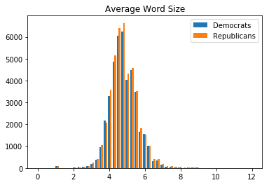
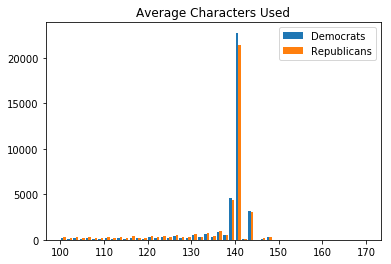
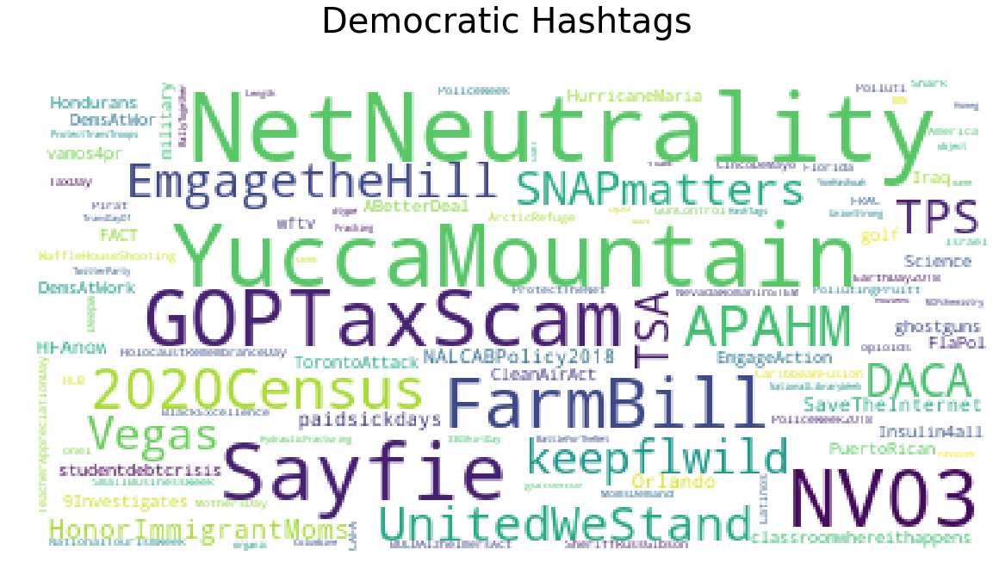
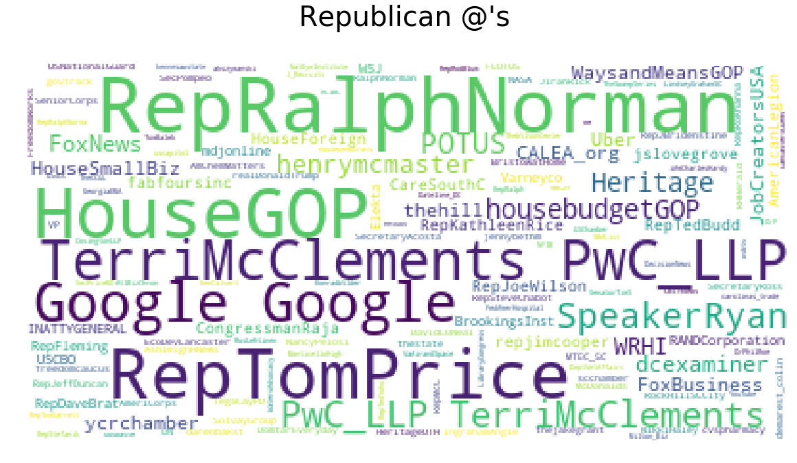
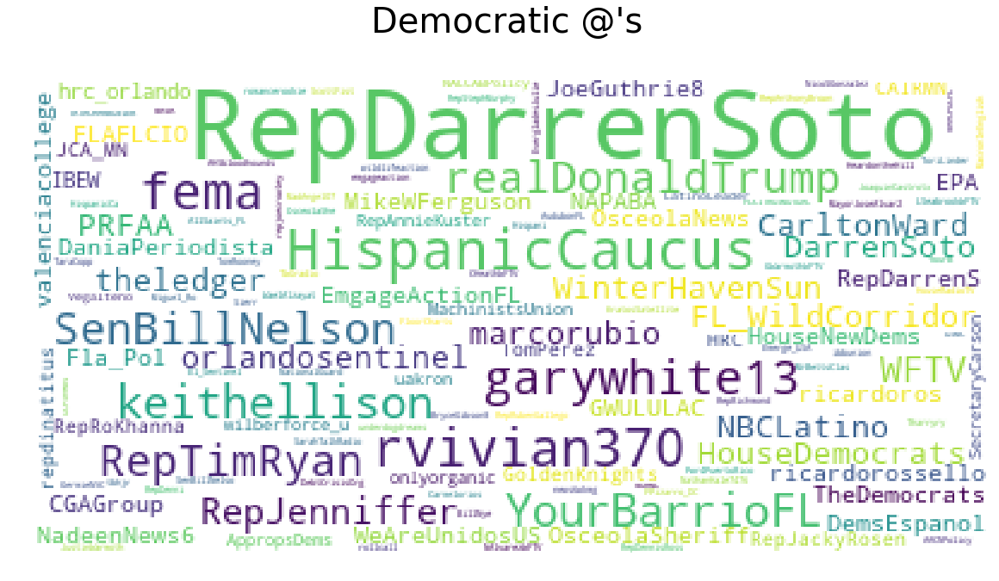

---
layout:default
---

<a id='Tweet Classification'></a>

## Please see below link below for video
https://youtu.be/S8scItI61gw


```python
import pandas as pd
import re
import string
import nltk
import numpy as np
import random

##word clouds
import matplotlib.pyplot as plt
import matplotlib as mpl
from wordcloud import WordCloud, STOPWORDS
from subprocess import check_output
from matplotlib import pyplot

# models
from sklearn.model_selection import train_test_split
from sklearn.feature_extraction.text import TfidfVectorizer
from sklearn.feature_extraction.text import CountVectorizer
from sklearn.ensemble import GradientBoostingClassifier
from sklearn.ensemble import RandomForestClassifier
from sklearn.naive_bayes import MultinomialNB
from sklearn.linear_model import LogisticRegression
from sklearn import metrics
from sklearn.metrics import classification_report
from sklearn.metrics import precision_recall_fscore_support as score
#print options
pd.set_option('display.max_rows', 500)
pd.set_option('display.max_columns', 500)
pd.set_option('display.width', 1000)

# set seed
random.seed(10)
```


```python
tweet_df = pd.read_csv("ExtractedTweets.csv")
tweet_df.columns = tweet_df.columns.str.strip()
tweet_df.info()
```

    <class 'pandas.core.frame.DataFrame'>
    RangeIndex: 86460 entries, 0 to 86459
    Data columns (total 3 columns):
    Party     86460 non-null object
    Handle    86460 non-null object
    Tweet     86460 non-null object
    dtypes: object(3)
    memory usage: 2.0+ MB
    

## Mapping tweets to political party
Above dataframe contains the latest 200 tweets by 433 members of congress in May of 2018. We wanted to know if we can look at the tweets themselves and determine if the member who created the tweet was a democrat or a republican. Some of the tweets are retweets. We are going to operate under the assumption that retweets are likely to still represent values that relate to party ideology.  This may be a poor assumption. We likely should analyze non retweets or attempt to determine the differences between the sets. However, as this is an introductory attempt to use NLP to determine party preference, we will assume retweets by a representative are likely to represent their party ideology.  

## Feature Engineering 
+ As these are tweets, # and @ will likely carry importance
    + Our idea is to extract all of these from the tweet column and build them out as features and custom hot encode them as features
    + Retweets mentioning the politicians name by @politician_name may unfairly bias the data. 
+ Certain policy terms should surely give away ideology.  I.E terms like "pro-life" or "pro-gun", " pro choice"
    + An example of the influence of all combinations of the term prolife is explored below
    + In the end, we did not build out features to target certain terms.  Instead we built bigrams and took the most frequently appearing bigrams
+ Due to the size of the data, we were faced with a choice of running models on a sample to feed into the vectorizers or custom building a dictionary from the most used ngrams in the dataset.
    + We chose to create a custom dictionary to load into our vectorizer.  This dictionary as well as twitter features are  technically trained on the entire dataset, therefore the test data isn't fully unseen which may bias results.  
 

## Functions


```python
stopwords = nltk.corpus.stopwords.words('english')
ps = nltk.PorterStemmer()
tweet_df = pd.read_csv("ExtractedTweets.csv")


def initial_casechange(text):
    # Change case
    text = "".join([word.lower()
                    for word in text if word not in string.punctuation])


def clean_text(text):
    # Cleans corpus
    text = "".join([word.lower()
                    for word in text if word not in string.punctuation])
    text = re.sub(r'[0-9]+', '', text)
    tokens = re.split('\W+', text)
    text = [ps.stem(word) for word in tokens if word not in stopwords]
    return text


def Remove_Twitter_Tags(tweet_df):
    # Removes all twitter features from corpus
    tweet_df['No_Twitter_Tags'] = tweet_df['Tweet'].apply(
        lambda x:  re.sub(r"(@\w+)", " ", x))
    tweet_df['No_Twitter_Tags'] = tweet_df['No_Twitter_Tags'].apply(
        lambda x:  re.sub(r"(#\w+)", "", x))
    tweet_df['No_Twitter_Tags'] = tweet_df['No_Twitter_Tags'].apply(
        lambda x:  re.sub(r'https?://t.co/(?:[-\w.]|(?:%[\da-fA-F]{2}))+', "", x))
    return tweet_df


def map_retweets(tweet_df):
    # Captures degree of retweet
    mapped_retweets = []
    for x in tweet_df["Retweet"]:
        if len(x) == 0:
            mapped_retweets.append(0)
        elif len(x) == 1:
            mapped_retweets.append(1)
        elif len(x) == 2:
            mapped_retweets.append(2)
        elif len(x) == 3:
            mapped_retweets.append(3)
    tweet_df["Retweet"] = pd.Series(mapped_retweets)
    return tweet_df


def Find_Twitter_Tags(tweet_df):
    # Extracts all twitter handles, hashtags,links and if Retweet
    tweet_df["Retweet"] = tweet_df['Tweet'].apply(
        lambda x:  re.findall(r"(RT )", x))
    tweet_df['Handles'] = tweet_df['Tweet'].apply(
        lambda x:  re.findall(r"(@\w+)", x))
    tweet_df['HashTags'] = tweet_df['Tweet'].apply(
        lambda x:  re.findall(r"(#\w+)", x))
    tweet_df['links'] = tweet_df['Tweet'].apply(lambda x:  re.findall(
        'https?://t.co/(?:[-\w.]|(?:%[\da-fA-F]{2}))+', x))
    tweet_df['Total_characters'] = tweet_df['Tweet'].apply(lambda x: len(x))
    tweet_df = map_retweets(tweet_df)
    tweet_df = Remove_Twitter_Tags(tweet_df)
    tweet_df['No_Twitter_Tags'] = tweet_df['No_Twitter_Tags'].apply(
        lambda x:  re.sub(r"RT ", ' ', x))
    tweet_df['Avg_word_length'] = tweet_df['No_Twitter_Tags'].apply(
        lambda x: np.mean([len(w) for w in x.split()]))
    return(tweet_df)


def make_bigrams(text):
    # extracts and cleans bigrams
    text = "".join([word.lower()
                    for word in text if word not in string.punctuation])
    text = re.sub(r'[0-9]+', '', text)
    tokens = re.split('\W+', text)
    text = [word for word in tokens if word not in stopwords]
    ngrams = zip(*[text[i:] for i in range(2)])
    text = [" ".join(ngram) for ngram in ngrams]
    return text


def stemmer(text):
    # stems corpus
    text = "".join([word.lower()
                    for word in text if word not in string.punctuation])
    tokens = re.split('\W+', text)
    text = [word for word in tokens if word not in stopwords]
    return text
```

## Build DF
+ Calls Find_Twitter tags which extracts all twitter features into columns and removes terms from general corpus 


```python
tweet_df = Find_Twitter_Tags(tweet_df)
tweet_df["Retweet"].value_counts()
tweet_df.head()
```

    E:\Anaconda\lib\site-packages\numpy\core\fromnumeric.py:2920: RuntimeWarning: Mean of empty slice.
      out=out, **kwargs)
    


<div>
<style scoped>
    .dataframe tbody tr th:only-of-type {
        vertical-align: middle;
    }

    .dataframe tbody tr th {
        vertical-align: top;
    }

    .dataframe thead th {
        text-align: right;
    }
</style>
<table border="1" class="dataframe">
  <thead>
    <tr style="text-align: right;">
      <th></th>
      <th>Party</th>
      <th>Handle</th>
      <th>Tweet</th>
      <th>Retweet</th>
      <th>Handles</th>
      <th>HashTags</th>
      <th>links</th>
      <th>Total_characters</th>
      <th>No_Twitter_Tags</th>
      <th>Avg_word_length</th>
    </tr>
  </thead>
  <tbody>
    <tr>
      <th>0</th>
      <td>Democrat</td>
      <td>RepDarrenSoto</td>
      <td>Today, Senate Dems vote to #SaveTheInternet. P...</td>
      <td>0</td>
      <td>[]</td>
      <td>[#SaveTheInternet, #NetNeutrality]</td>
      <td>[https://t.co/n3tggDLU1L]</td>
      <td>139</td>
      <td>Today, Senate Dems vote to . Proud to support ...</td>
      <td>4.666667</td>
    </tr>
    <tr>
      <th>1</th>
      <td>Democrat</td>
      <td>RepDarrenSoto</td>
      <td>RT @WinterHavenSun: Winter Haven resident / Al...</td>
      <td>1</td>
      <td>[@WinterHavenSun, @RepDarrenSoto]</td>
      <td>[]</td>
      <td>[]</td>
      <td>140</td>
      <td>: Winter Haven resident / Alta Vista teacher...</td>
      <td>5.000000</td>
    </tr>
    <tr>
      <th>2</th>
      <td>Democrat</td>
      <td>RepDarrenSoto</td>
      <td>RT @NBCLatino: .@RepDarrenSoto noted that Hurr...</td>
      <td>1</td>
      <td>[@NBCLatino, @RepDarrenSoto]</td>
      <td>[]</td>
      <td>[]</td>
      <td>140</td>
      <td>: .  noted that Hurricane Maria has left app...</td>
      <td>5.222222</td>
    </tr>
    <tr>
      <th>3</th>
      <td>Democrat</td>
      <td>RepDarrenSoto</td>
      <td>RT @NALCABPolicy: Meeting with @RepDarrenSoto ...</td>
      <td>1</td>
      <td>[@NALCABPolicy, @RepDarrenSoto, @LatinoLeader]</td>
      <td>[#NALCABPolicy2018]</td>
      <td>[]</td>
      <td>140</td>
      <td>: Meeting with   . Thanks for taking the tim...</td>
      <td>3.937500</td>
    </tr>
    <tr>
      <th>4</th>
      <td>Democrat</td>
      <td>RepDarrenSoto</td>
      <td>RT @Vegalteno: Hurricane season starts on June...</td>
      <td>1</td>
      <td>[@Vegalteno, @Pwr4PuertoRico, @RepDarrenSoto, ...</td>
      <td>[]</td>
      <td>[]</td>
      <td>133</td>
      <td>: Hurricane season starts on June 1st; Puert...</td>
      <td>6.090909</td>
    </tr>
  </tbody>
</table>
</div>


## EDA of party representation
+ Explore Party breakdown of custom features 
+ below we graph histograms by party of average word size as well as characters used.


```python
tweet_df.groupby('Party').mean()  
```


<div>
<style scoped>
    .dataframe tbody tr th:only-of-type {
        vertical-align: middle;
    }

    .dataframe tbody tr th {
        vertical-align: top;
    }

    .dataframe thead th {
        text-align: right;
    }
</style>
<table border="1" class="dataframe">
  <thead>
    <tr style="text-align: right;">
      <th></th>
      <th>Retweet</th>
      <th>Total_characters</th>
      <th>Avg_word_length</th>
    </tr>
    <tr>
      <th>Party</th>
      <th></th>
      <th></th>
      <th></th>
    </tr>
  </thead>
  <tbody>
    <tr>
      <th>Democrat</th>
      <td>0.216269</td>
      <td>131.289698</td>
      <td>4.823613</td>
    </tr>
    <tr>
      <th>Republican</th>
      <td>0.225469</td>
      <td>128.681654</td>
      <td>4.831475</td>
    </tr>
  </tbody>
</table>
</div>


```python
%matplotlib inline

# avg word length by party histogram (Longer versus shorter words)
bins = np.linspace(0, 12)

Democrats = tweet_df[tweet_df['Party'] == 'Democrat']['Avg_word_length']
Republicans = tweet_df[tweet_df['Party'] == 'Republican']['Avg_word_length']
plt.hist([Democrats, Republicans], bins, label=['Democrats', 'Republicans'])
plt.legend(loc='upper right')
plt.title("Average Word Size")
plt.show()


# total words used by party histogram
bins = np.linspace(100, 170)
Democrats = tweet_df[tweet_df['Party'] == 'Democrat'] ['Total_characters']
Republicans = tweet_df[tweet_df['Party'] == 'Republican'] ['Total_characters']
plt.hist([Democrats, Republicans], bins, label=['Democrats', 'Republicans'])
plt.legend(loc='upper right')
plt.title("Average Characters Used")
plt.show()


```








## Example of bigrams we expect to have strong influence
+ If we had more time, we would develop custom built bigrams
+ politically charged language is likely to represent ideology
+ Below we search for all combinations  of the word Pro-life and display which party rep used the language and how often


```python
# REGEX finds all forms of prolife and stores them as hot encoded column
tweet_df['Pro_life'] = tweet_df['Tweet'].apply(
    lambda x: re.findall(r"([pP]ro(?:-|\s)[Ll]ife)", x))

indexes = [i for i, x in enumerate(tweet_df['Pro_life']) if x]
print("Out of {} uses of the word pro life, {} are Democrats, {} are Republicans".format(len(indexes),
                                                                                         len(
                                                                                             tweet_df.iloc[indexes][tweet_df['Party'] == "Democrat"]),
                                                                                         len(tweet_df.iloc[indexes][tweet_df['Party'] == "Republican"])))
```

    Out of 37 uses of the word pro life, 5 are Democrats, 32 are Republicans
    

    E:\Anaconda\lib\site-packages\ipykernel_launcher.py:8: UserWarning: Boolean Series key will be reindexed to match DataFrame index.
      
    E:\Anaconda\lib\site-packages\ipykernel_launcher.py:9: UserWarning: Boolean Series key will be reindexed to match DataFrame index.
      if __name__ == '__main__':
    

## Tokenize and create bigrams
+ Use custom built functions to Create Bigrams, Tokenize(single words), and ngrams column(combination of both)


```python
tweet_df['bigrams'] = tweet_df['No_Twitter_Tags'].apply(
    lambda x: make_bigrams(x))
tweet_df['tokenize'] = tweet_df['No_Twitter_Tags'].apply(
    lambda x: clean_text(x))
tweet_df['ngrams'] = tweet_df['bigrams']+tweet_df['tokenize']
tweet_df.head()
```


<div>
<style scoped>
    .dataframe tbody tr th:only-of-type {
        vertical-align: middle;
    }

    .dataframe tbody tr th {
        vertical-align: top;
    }

    .dataframe thead th {
        text-align: right;
    }
</style>
<table border="1" class="dataframe">
  <thead>
    <tr style="text-align: right;">
      <th></th>
      <th>Party</th>
      <th>Handle</th>
      <th>Tweet</th>
      <th>Retweet</th>
      <th>Handles</th>
      <th>HashTags</th>
      <th>links</th>
      <th>Total_characters</th>
      <th>No_Twitter_Tags</th>
      <th>Avg_word_length</th>
      <th>Pro_life</th>
      <th>bigrams</th>
      <th>tokenize</th>
      <th>ngrams</th>
    </tr>
  </thead>
  <tbody>
    <tr>
      <th>0</th>
      <td>Democrat</td>
      <td>RepDarrenSoto</td>
      <td>Today, Senate Dems vote to #SaveTheInternet. P...</td>
      <td>0</td>
      <td>[]</td>
      <td>[#SaveTheInternet, #NetNeutrality]</td>
      <td>[https://t.co/n3tggDLU1L]</td>
      <td>139</td>
      <td>Today, Senate Dems vote to . Proud to support ...</td>
      <td>4.666667</td>
      <td>[]</td>
      <td>[today senate, senate dems, dems vote, vote pr...</td>
      <td>[today, senat, dem, vote, proud, support, simi...</td>
      <td>[today senate, senate dems, dems vote, vote pr...</td>
    </tr>
    <tr>
      <th>1</th>
      <td>Democrat</td>
      <td>RepDarrenSoto</td>
      <td>RT @WinterHavenSun: Winter Haven resident / Al...</td>
      <td>1</td>
      <td>[@WinterHavenSun, @RepDarrenSoto]</td>
      <td>[]</td>
      <td>[]</td>
      <td>140</td>
      <td>: Winter Haven resident / Alta Vista teacher...</td>
      <td>5.000000</td>
      <td>[]</td>
      <td>[ winter, winter resident, resident alta, alta...</td>
      <td>[, winter, resid, alta, vista, teacher, one, s...</td>
      <td>[ winter, winter resident, resident alta, alta...</td>
    </tr>
    <tr>
      <th>2</th>
      <td>Democrat</td>
      <td>RepDarrenSoto</td>
      <td>RT @NBCLatino: .@RepDarrenSoto noted that Hurr...</td>
      <td>1</td>
      <td>[@NBCLatino, @RepDarrenSoto]</td>
      <td>[]</td>
      <td>[]</td>
      <td>140</td>
      <td>: .  noted that Hurricane Maria has left app...</td>
      <td>5.222222</td>
      <td>[]</td>
      <td>[ noted, noted hurricane, hurricane maria, mar...</td>
      <td>[, note, hurrican, maria, left, approxim, bill...</td>
      <td>[ noted, noted hurricane, hurricane maria, mar...</td>
    </tr>
    <tr>
      <th>3</th>
      <td>Democrat</td>
      <td>RepDarrenSoto</td>
      <td>RT @NALCABPolicy: Meeting with @RepDarrenSoto ...</td>
      <td>1</td>
      <td>[@NALCABPolicy, @RepDarrenSoto, @LatinoLeader]</td>
      <td>[#NALCABPolicy2018]</td>
      <td>[]</td>
      <td>140</td>
      <td>: Meeting with   . Thanks for taking the tim...</td>
      <td>3.937500</td>
      <td>[]</td>
      <td>[ meeting, meeting thanks, thanks taking, taki...</td>
      <td>[, meet, thank, take, time, meet, ed, marucci,...</td>
      <td>[ meeting, meeting thanks, thanks taking, taki...</td>
    </tr>
    <tr>
      <th>4</th>
      <td>Democrat</td>
      <td>RepDarrenSoto</td>
      <td>RT @Vegalteno: Hurricane season starts on June...</td>
      <td>1</td>
      <td>[@Vegalteno, @Pwr4PuertoRico, @RepDarrenSoto, ...</td>
      <td>[]</td>
      <td>[]</td>
      <td>133</td>
      <td>: Hurricane season starts on June 1st; Puert...</td>
      <td>6.090909</td>
      <td>[]</td>
      <td>[ hurricane, hurricane season, season starts, ...</td>
      <td>[, hurrican, season, start, june, st, puerto, ...</td>
      <td>[ hurricane, hurricane season, season starts, ...</td>
    </tr>
  </tbody>
</table>
</div>


### Looking at single words 
+ Finds how many words were used over 50 times in the tweet corpus(2136)


```python
# Tokenize single words
single_counts = pd.Series(np.concatenate(
    [x for x in tweet_df["tokenize"]])).value_counts()
len(single_counts[single_counts > 100])
print("Out of {} total words, {} are used over 50 times".format(len(single_counts),
                                                                len(
                                                                    single_counts[single_counts > 50])
                                                                ))
```

    Out of 29279 total words, 2136 are used over 50 times
    

### Looking at Bigrams
+ Same as above but with bigrams and a threshold of 20
+ We will extract the top 2024


```python
bigram_series = pd.Series(np.concatenate(
    [x for x in tweet_df["bigrams"]])).value_counts()
bigram_series.index = bigram_series.index.str.strip()
bigram_series[1:15]
```


    th                 780
    high school        757
    president trump    689
    tax reform         677
    tax cuts           672
    w                  635
    today              625
    town hall          579
    today              553
                       544
    last week          518
    https              513
    c                  507
    last night         500
    dtype: int64


+ We can see that the bigrams has returned some imporper bigrams.  We need to filter for bigrams that have pattern 'Word Word'


```python
# filter out weird non bigrams
real_bigrams = [x for x in bigram_series.index if len(x.split(" ")) == 2]
print(real_bigrams[0:15])
bigram_series = bigram_series[bigram_series.index.isin(real_bigrams)]

print("\n Out of {} total words, {} are used over 20 times".format(len(bigram_series),
                                                                   len(
                                                                       bigram_series[bigram_series > 20])
                                                                   ))
```

    ['high school', 'president trump', 'tax reform', 'tax cuts', 'town hall', 'last week', 'last night', 'small businesses', 'tax code', 'health care', 'men women', 'congressional art', 'looking forward', 'american people', 'art competition']
    
     Out of 409904 total words, 2024 are used over 20 times
    

### Join our bigram and single word indexes
+ This dictionary will eventually be used to build our Count Vectorizer in modeling stage


```python
our_indexes = bigram_series[0:2025].append(single_counts[:2137])
my_words = our_indexes.index
my_words2 = [my_words]
```


```python
my_words2
```


    [Index(['high school', 'president trump', 'tax reform', 'tax cuts', 'town hall', 'last week', 'last night', 'small businesses', 'tax code', 'health care',
            ...
            'fewer', 'penc', 'own', 'dossier', 'ame', 'teen', 'paus', 'strateg', 'fan', 'billionair'], dtype='object', length=4162)]


## Look at hashtag's frequency
+ Lets look at the most frequent hashtags
+ Extract Hashtags used more than 10 time in corpus(547 total)


```python
my_hashtags = pd.Series(np.concatenate(
    [x for x in tweet_df["HashTags"]])).value_counts()
# take top 547 hashtags hash tags used more than 10 times
hashtags_for_vectorizor = my_hashtags[:547].index
my_hashtags[1:10]
```


    #TaxReform            583
    #TaxCutsandJobsAct    544
    #SOTU                 389
    #taxreform            340
    #DACA                 336
    #TaxDay               291
    #NetNeutrality        266
    #SNAP                 228
    #SmallBusinessWeek    225
    dtype: int64


```python
my_hashtags = pd.Series(np.concatenate([x for x in tweet_df["HashTags"]]))

# Look at each row of df that uses a hashtag, prints hashtag
# sums amount of dems and republicans using tag
for x in my_hashtags[1:10]:
    tweet_df2 = tweet_df.copy()
    tweet_df2[x] = tweet_df2['Tweet'].apply(lambda y: re.findall(x, y))
    indexes = [i for i, z in enumerate(tweet_df2[x]) if z]
    tweet_df2['Party'][indexes]
    print("Out of {} uses of the word {}, {} are Democrats, {} are Republicans".format(len(indexes),
                                                                                       x,
                                                                                       len(
                                                                                           tweet_df2.iloc[indexes][tweet_df2['Party'] == "Democrat"]),
                                                                                       len(tweet_df2.iloc[indexes][tweet_df2['Party'] == "Republican"])))
```

    E:\Anaconda\lib\site-packages\ipykernel_launcher.py:13: UserWarning: Boolean Series key will be reindexed to match DataFrame index.
      del sys.path[0]
    E:\Anaconda\lib\site-packages\ipykernel_launcher.py:14: UserWarning: Boolean Series key will be reindexed to match DataFrame index.
      
    

    Out of 267 uses of the word #NetNeutrality, 263 are Democrats, 4 are Republicans
    Out of 1 uses of the word #NALCABPolicy2018, 1 are Democrats, 0 are Republicans
    Out of 267 uses of the word #NetNeutrality, 263 are Democrats, 4 are Republicans
    Out of 18 uses of the word #Orlando, 16 are Democrats, 2 are Republicans
    Out of 1 uses of the word #HFAnow, 1 are Democrats, 0 are Republicans
    Out of 12 uses of the word #paidsickdays, 12 are Democrats, 0 are Republicans
    Out of 1 uses of the word #classroomwhereithappens, 1 are Democrats, 0 are Republicans
    Out of 2 uses of the word #FACT, 2 are Democrats, 0 are Republicans
    Out of 80 uses of the word #ABetterDeal, 78 are Democrats, 2 are Republicans
    

## Look at links
+ It's interesting for some non NLP analysis, but there isn't much value in terms of modeling
    + One of top links was Scooter Libby being pardoned
+ Links will be ignored in modeling stage


```python
pd.Series(np.concatenate([x for x in tweet_df["links"]])).value_counts()[1:10]
```


    https://t.co/hISaCI95CB    10
    http://t.co/BOWfOkBG       10
    https://t.co/lMQVxRGElp    10
    https://t.co/vTnOQfJPhp    10
    https://t.co/F1IbqgZrB4    10
    https://t.co/8htzynw0mp     9
    https://t.co/dqyGOuzN       9
    https://t.co/vTnOQg1q8X     9
    https://t.co/wisO7NzmkI     8
    dtype: int64


## Look at @'s
+ Same process as hashtags


```python
handle_counts = pd.Series(np.concatenate(
    [x for x in tweet_df["Handles"]])).value_counts()
handle_counts_vectorizor = handle_counts[handle_counts > 20].index
```


```python
my_Handles = pd.Series(np.concatenate([x for x in tweet_df["Handles"]]))
for x in my_Handles[0:10]:
    tweet_df2 = tweet_df.copy()
    tweet_df2[x] = tweet_df2['Tweet'].apply(lambda y: re.findall(x, y))
    indexes = [i for i, z in enumerate(tweet_df2[x]) if z]
    tweet_df2['Party'][indexes]
    print("Out of {} uses of the word {}, {} are Democrats, {} are Republicans".format(len(indexes),
                                                                                       x,
                                                                                       len(
                                                                                           tweet_df2.iloc[indexes][tweet_df2['Party'] == "Democrat"]),
                                                                                       len(tweet_df2.iloc[indexes][tweet_df2['Party'] == "Republican"])))
```

    E:\Anaconda\lib\site-packages\ipykernel_launcher.py:10: UserWarning: Boolean Series key will be reindexed to match DataFrame index.
      # Remove the CWD from sys.path while we load stuff.
    E:\Anaconda\lib\site-packages\ipykernel_launcher.py:11: UserWarning: Boolean Series key will be reindexed to match DataFrame index.
      # This is added back by InteractiveShellApp.init_path()
    

    Out of 3 uses of the word @WinterHavenSun, 3 are Democrats, 0 are Republicans
    Out of 94 uses of the word @RepDarrenSoto, 92 are Democrats, 2 are Republicans
    Out of 8 uses of the word @NBCLatino, 6 are Democrats, 2 are Republicans
    Out of 94 uses of the word @RepDarrenSoto, 92 are Democrats, 2 are Republicans
    Out of 1 uses of the word @NALCABPolicy, 1 are Democrats, 0 are Republicans
    Out of 94 uses of the word @RepDarrenSoto, 92 are Democrats, 2 are Republicans
    Out of 1 uses of the word @LatinoLeader, 1 are Democrats, 0 are Republicans
    Out of 1 uses of the word @Vegalteno, 1 are Democrats, 0 are Republicans
    Out of 1 uses of the word @Pwr4PuertoRico, 1 are Democrats, 0 are Republicans
    Out of 94 uses of the word @RepDarrenSoto, 92 are Democrats, 2 are Republicans
    

## Build out  Hot encoded df for hashtags and @
+ Build out hot encoded df with every @ as a column
+ Data check to make sure row indexes are still preserved


```python
hashtags_for_vectorizor
hashtags_df = pd.DataFrame()

for x in hashtags_for_vectorizor:
    hashtags_df[x] = tweet_df['Tweet'].apply(lambda y: re.findall(x, y))
    hashtags_df[x] = hashtags_df[x].apply(lambda y: 1 if len(y) > 0 else 0)

# data check
sample_index = hashtags_df[hashtags_df['#taxreform'] == 1][:5].index
tweet_df["HashTags"][sample_index]
```


    14543                              [#taxreform]
    17753    [#taxreform, #shutdown, #2018midterms]
    19980                  [#baltimore, #taxreform]
    37837                              [#taxreform]
    37855                              [#taxreform]
    Name: HashTags, dtype: object


```python
handle_counts_vectorizor
my_Handles_df = pd.DataFrame()

for x in handle_counts_vectorizor:
    my_Handles_df[x] = tweet_df['Tweet'].apply(lambda y: re.findall(x, y))
    my_Handles_df[x] = my_Handles_df[x].apply(lambda y: 1 if len(y) > 0 else 0)

# data check
sample_index = my_Handles_df[my_Handles_df['@realDonaldTrump'] == 1][:5].index
tweet_df["Handles"][sample_index]
```


    11                                  [@realDonaldTrump]
    133    [@nikkifried, @realDonaldTrump, @RepDarrenSoto]
    141                                 [@realDonaldTrump]
    621                                 [@realDonaldTrump]
    739                      [@NILC_org, @realDonaldTrump]
    Name: Handles, dtype: object


## Join df's together
+ Much of the above was exploratory
+ we need to get rid of all the tokenized columns(ngrams bigrams tokenize) as we will build them with Count Vectorizer
+ We will keep all hot encoded twitter tags and handles, and use the No twitter tags text column to build ngrams=(0,2) before modeling.  
+ We will build a vectorizer with the custom dictionary we built above.


```python
final_df = pd.concat([my_Handles_df, hashtags_df, tweet_df], axis=1)
# get rid of built columns ngrams,bigrams,tokenize
final_df = final_df.drop(['bigrams', 'tokenize', 'ngrams', 'Pro_life',
                          'Handles', "HashTags", "links", "Tweet", "Handle"], axis=1)
final_df.head()
```


<div>
<style scoped>
    .dataframe tbody tr th:only-of-type {
        vertical-align: middle;
    }

    .dataframe tbody tr th {
        vertical-align: top;
    }

    .dataframe thead th {
        text-align: right;
    }
</style>
<table border="1" class="dataframe">
  <thead>
    <tr style="text-align: right;">
      <th></th>
      <th>@realDonaldTrump</th>
      <th>@POTUS</th>
      <th>@HouseGOP</th>
      <th>@SpeakerRyan</th>
      <th>@FoxNews</th>
      <th>@HouseCommerce</th>
      <th>@EPAScottPruitt</th>
      <th>@WaysandMeansGOP</th>
      <th>@HouseDemocrats</th>
      <th>@FoxBusiness</th>
      <th>@HouseAppropsGOP</th>
      <th>@SteveScalise</th>
      <th>@WhiteHouse</th>
      <th>@NancyPelosi</th>
      <th>@OfficialCBC</th>
      <th>@NatResources</th>
      <th>@HouseAgNews</th>
      <th>@HouseJudiciary</th>
      <th>@FinancialCmte</th>
      <th>@HispanicCaucus</th>
      <th>@RepGoodlatte</th>
      <th>@HASCRepublicans</th>
      <th>@EPA</th>
      <th>@VP</th>
      <th>@OversightDems</th>
      <th>@MacTXPress</th>
      <th>@RepKevinBrady</th>
      <th>@RepMcCaul</th>
      <th>@cspan</th>
      <th>@RepCummings</th>
      <th>@Jim_Jordan</th>
      <th>@FCC</th>
      <th>@HouseScience</th>
      <th>@HouseHomeland</th>
      <th>@TGowdySC</th>
      <th>@MSNBC</th>
      <th>@SecretaryZinke</th>
      <th>@GOPLeader</th>
      <th>@HouseJudDems</th>
      <th>@EnergyCommerce</th>
      <th>@RepMarkWalker</th>
      <th>@RepJerryNadler</th>
      <th>@SecretarySonny</th>
      <th>@HouseForeign</th>
      <th>@RepTedDeutch</th>
      <th>@realdonaldtrump</th>
      <th>@justinamash</th>
      <th>@RepJayapal</th>
      <th>@DHSgov</th>
      <th>@DeptVetAffairs</th>
      <th>@cathymcmorris</th>
      <th>@RepEliotEngel</th>
      <th>@thehill</th>
      <th>@DrPhilRoe</th>
      <th>@ConawayTX11</th>
      <th>@RepDwightEvans</th>
      <th>@HurdOnTheHill</th>
      <th>@USCBO</th>
      <th>@RepDarrenSoto</th>
      <th>@repjohnlewis</th>
      <th>@GOPoversight</th>
      <th>@WhipHoyer</th>
      <th>@WaysMeansCmte</th>
      <th>@NRA</th>
      <th>@TomColeOK04</th>
      <th>@NydiaVelazquez</th>
      <th>@CFPB</th>
      <th>@RepDonBeyer</th>
      <th>@USDA</th>
      <th>@DeptofDefense</th>
      <th>@RepJoeKennedy</th>
      <th>@Interior</th>
      <th>@CNN</th>
      <th>@NASA</th>
      <th>@RepJohnKatko</th>
      <th>@RepMcGovern</th>
      <th>@RepRaskin</th>
      <th>@RepCohen</th>
      <th>@Transport</th>
      <th>@EdWorkforce</th>
      <th>@RepCurbelo</th>
      <th>@RosLehtinen</th>
      <th>@RepEspaillat</th>
      <th>@RepDanKildee</th>
      <th>@GOP</th>
      <th>@USNavy</th>
      <th>@RepBeatty</th>
      <th>@foxandfriends</th>
      <th>@keithellison</th>
      <th>@USRepRodney</th>
      <th>@RepMarkMeadows</th>
      <th>@RepRyanCostello</th>
      <th>@RepEdRoyce</th>
      <th>@RepMarcyKaptur</th>
      <th>@cspanwj</th>
      <th>@RodneyDavis</th>
      <th>@HouseFloor</th>
      <th>@TheJusticeDept</th>
      <th>@RepBarbaraLee</th>
      <th>@BennieGThompson</th>
      <th>@EmmanuelMacron</th>
      <th>@RepDianeBlack</th>
      <th>@westerncaucus</th>
      <th>@HouseVetAffairs</th>
      <th>@BarackObama</th>
      <th>@CongressmanRaja</th>
      <th>@RepRichmond</th>
      <th>@SenateDems</th>
      <th>@CongressionalAC</th>
      <th>@edworkforcedems</th>
      <th>@dcexaminer</th>
      <th>@RepDebDingell</th>
      <th>@RepMaxineWaters</th>
      <th>@RepCartwright</th>
      <th>@RepTimWalz</th>
      <th>@NatlParkService</th>
      <th>@RealDonaldTrump</th>
      <th>@RepBradWenstrup</th>
      <th>@uscapitol</th>
      <th>@StateDept</th>
      <th>@PeteSessions</th>
      <th>@BobbyScott</th>
      <th>@RepDeSantis</th>
      <th>@SBAgov</th>
      <th>@HASCDemocrats</th>
      <th>@SenSchumer</th>
      <th>@LamarSmithTX21</th>
      <th>@YouTube</th>
      <th>@virginiafoxx</th>
      <th>@DarrellIssa</th>
      <th>@RepRichardNeal</th>
      <th>@USChamber</th>
      <th>@GerryConnolly</th>
      <th>@RepHensarling</th>
      <th>@HHSGov</th>
      <th>@JECRepublicans</th>
      <th>@HUDgov</th>
      <th>@louiseslaughter</th>
      <th>@HouseSmallBiz</th>
      <th>@repgregwalden</th>
      <th>@RepRyanZinke</th>
      <th>@JudgeTedPoe</th>
      <th>@RepRoKhanna</th>
      <th>@facebook</th>
      <th>@MickMulvaneyOMB</th>
      <th>@SenDuckworth</th>
      <th>@TeamCavuto</th>
      <th>@Varneyco</th>
      <th>@RepJohnYarmuth</th>
      <th>@WSJ</th>
      <th>@SenJohnMcCain</th>
      <th>@MariaBartiromo</th>
      <th>@GreggHarper</th>
      <th>@RepPaulTonko</th>
      <th>@PeterRoskam</th>
      <th>@FLOTUS</th>
      <th>@RepZoeLofgren</th>
      <th>@RepLipinski</th>
      <th>@LCVoters</th>
      <th>@BetsyDeVosED</th>
      <th>@RepAlGreen</th>
      <th>@USTreasury</th>
      <th>@AmericaNewsroom</th>
      <th>@rosadelauro</th>
      <th>@repjoecrowley</th>
      <th>@RepStephMurphy</th>
      <th>@FBI</th>
      <th>@RepTedLieu</th>
      <th>@HFACDemocrats</th>
      <th>@RobWittman</th>
      <th>@RepGregoryMeeks</th>
      <th>@CNBC</th>
      <th>@RepMcEachin</th>
      <th>@RepMaloney</th>
      <th>@RepGutierrez</th>
      <th>@USArmy</th>
      <th>@HouseSBCDems</th>
      <th>@fema</th>
      <th>@RepByrne</th>
      <th>@RepAndyBarr</th>
      <th>@housebudgetGOP</th>
      <th>@RepSeanDuffy</th>
      <th>@RepCheri</th>
      <th>@HomelandDems</th>
      <th>@NitaLowey</th>
      <th>@RepJimBanks</th>
      <th>@CongressmanGT</th>
      <th>@RepMikeTurner</th>
      <th>@marcorubio</th>
      <th>@rep_stevewomack</th>
      <th>@FEMA</th>
      <th>@RepHuffman</th>
      <th>@RepLukeMesser</th>
      <th>@FrankPallone</th>
      <th>@RepLloydDoggett</th>
      <th>@nikiinthehouse</th>
      <th>@cbrangel</th>
      <th>@USCapitol</th>
      <th>@RepRaulGrijalva</th>
      <th>@SusanWBrooks</th>
      <th>@RepAnnWagner</th>
      <th>@RepSmucker</th>
      <th>@janschakowsky</th>
      <th>@RepFredUpton</th>
      <th>@RepGuthrie</th>
      <th>@RepWesterman</th>
      <th>@RepRubenGallego</th>
      <th>@RepublicanStudy</th>
      <th>@washingtonpost</th>
      <th>@RepBarragan</th>
      <th>@RepYvetteClarke</th>
      <th>@RepNewhouse</th>
      <th>@TransportDems</th>
      <th>@JoaquinCastrotx</th>
      <th>@RepMoolenaar</th>
      <th>@HouseNewDems</th>
      <th>@HouseBudgetDems</th>
      <th>@RepTrey</th>
      <th>@RepRobinKelly</th>
      <th>@nytimes</th>
      <th>@AustinScottGA08</th>
      <th>@RepErikPaulsen</th>
      <th>@NFIB</th>
      <th>@RepTipton</th>
      <th>@PeterWelch</th>
      <th>@USMC</th>
      <th>@RepAnnaEshoo</th>
      <th>@StaceyPlaskett</th>
      <th>@RepEsty</th>
      <th>@RepMikeHonda</th>
      <th>@CongressmanDan</th>
      <th>@RepLoisFrankel</th>
      <th>@RepHalRogers</th>
      <th>@RulesReps</th>
      <th>@RepDavidValadao</th>
      <th>@SecNielsen</th>
      <th>@USArmyReserve</th>
      <th>@stevenmnuchin1</th>
      <th>@RepTomEmmer</th>
      <th>@RepBrianMast</th>
      <th>@RepLawrence</th>
      <th>@MorningsMaria</th>
      <th>@JacksonLeeTX18</th>
      <th>@RepWalberg</th>
      <th>@DrDenaGrayson</th>
      <th>@repmarkpocan</th>
      <th>@MarioDB</th>
      <th>@RepAnthonyBrown</th>
      <th>@USProgressives</th>
      <th>@AjitPaiFCC</th>
      <th>...</th>
      <th>#GenderWageGa</th>
      <th>#VA01</th>
      <th>#MuellerInvestigation</th>
      <th>#STOPSchoolViolenceAct</th>
      <th>#House</th>
      <th>#CultureOfCorruption</th>
      <th>#ArmenianGenocide</th>
      <th>#NDAA17</th>
      <th>#Nevada</th>
      <th>#StateOfTheUnion</th>
      <th>#energy</th>
      <th>#Vietnam</th>
      <th>#OpenEnrollment</th>
      <th>#InfrastructureWeek</th>
      <th>#FL26</th>
      <th>#PROMESA</th>
      <th>#GoBlue</th>
      <th>#ArcticRefuge</th>
      <th>#Nebraska</th>
      <th>#trans</th>
      <th>#TownHallForOurLives</th>
      <th>#Pennsylvania</th>
      <th>#gunsafety</th>
      <th>#GrahamCassidy</th>
      <th>#SchoolChoice</th>
      <th>#SC</th>
      <th>#PresidentsDay</th>
      <th>#Orlando</th>
      <th>#TeamDutch</th>
      <th>#ActOnClimate</th>
      <th>#SaveOurCitrus</th>
      <th>#tax</th>
      <th>#NationalFarmersDay</th>
      <th>#paidleave</th>
      <th>#ENDALZ</th>
      <th>#taxcuts</th>
      <th>#ROC</th>
      <th>#opioids</th>
      <th>#shutdown</th>
      <th>#OK2</th>
      <th>#SC07</th>
      <th>#CivilRights</th>
      <th>#TeamMLG</th>
      <th>#NY24</th>
      <th>#VA</th>
      <th>#ParisAgreement</th>
      <th>#Houston</th>
      <th>#CA33</th>
      <th>#Georgia</th>
      <th>#transgender</th>
      <th>#AustinBombings</th>
      <th>#FBI</th>
      <th>#Senate</th>
      <th>#Pruitt</th>
      <th>#MobileOfficeHours</th>
      <th>#DEATakeBack</th>
      <th>#Olympics</th>
      <th>#arnews</th>
      <th>#MD01</th>
      <th>#goodtrouble</th>
      <th>#SOTU2018</th>
      <th>#NationalPuppyDay</th>
      <th>#LangevinHitsTheRhode</th>
      <th>#DrainTheSwamp</th>
      <th>#HurricaneIrma</th>
      <th>#BostonMarathon</th>
      <th>#ElectionDay</th>
      <th>#MilitarySpouseAppreciationDay</th>
      <th>#PlannedParenthood</th>
      <th>#FISAMemo</th>
      <th>#HudsonValley</th>
      <th>#PA15</th>
      <th>#FLM2018</th>
      <th>#MN07</th>
      <th>#TaxDay2018</th>
      <th>#GA08</th>
      <th>#NY03</th>
      <th>#veteran</th>
      <th>#StopSchoolViolenceAct</th>
      <th>#LGBT</th>
      <th>#MO07</th>
      <th>#vote</th>
      <th>#AgDay</th>
      <th>#TinderFire</th>
      <th>#NewDem</th>
      <th>#Kauai</th>
      <th>#Worcester</th>
      <th>#AZ09</th>
      <th>#TeamPeters</th>
      <th>#TX24</th>
      <th>#OH</th>
      <th>#FlashbackFriday</th>
      <th>#NewYork</th>
      <th>#Ohio</th>
      <th>#GOPEnergySolutions</th>
      <th>#Comey</th>
      <th>#FinalFour</th>
      <th>#Columbine</th>
      <th>#BillyGraham</th>
      <th>#Kilauea</th>
      <th>#USARBirthday110</th>
      <th>#SubCommTech</th>
      <th>#MLK</th>
      <th>#ABQ</th>
      <th>#NRA</th>
      <th>#DreamActNow</th>
      <th>#GA13</th>
      <th>#smallbusiness</th>
      <th>#CA44</th>
      <th>#JCPOA</th>
      <th>#VegasBorn</th>
      <th>#Taxreform</th>
      <th>#education</th>
      <th>#MayDay</th>
      <th>#PeaceOfficersMemorialDay</th>
      <th>#CA</th>
      <th>#CongressionalAppChallenge</th>
      <th>#SNAPmatters</th>
      <th>#GunsInAmerica</th>
      <th>#NursesWeek</th>
      <th>#GoodFriday</th>
      <th>#AutismAwarenessMonth</th>
      <th>#PoliceWeek2018</th>
      <th>#America</th>
      <th>#FBF</th>
      <th>#PROSPER</th>
      <th>#taxes</th>
      <th>#tariffs</th>
      <th>#TitleX</th>
      <th>#arpx</th>
      <th>#PROSPERAct</th>
      <th>#VietnamWar</th>
      <th>#WA</th>
      <th>#Tampa</th>
      <th>#MarchforLife</th>
      <th>#TakeYourChildToWorkDay</th>
      <th>#NationalPetDay</th>
      <th>#alpolitics</th>
      <th>#LasVegas</th>
      <th>#NE03</th>
      <th>#Cuba</th>
      <th>#SemperFi</th>
      <th>#GOPWorking4Women</th>
      <th>#DOJ</th>
      <th>#broadband</th>
      <th>#RaiseTheWage</th>
      <th>#FISA702</th>
      <th>#LDTC17</th>
      <th>#TeamRepTakai</th>
      <th>#Nicaragua</th>
      <th>#ThankATeacher</th>
      <th>#DCStatehood</th>
      <th>#FarmBillFriday</th>
      <th>#WATCH</th>
      <th>#Mi01</th>
      <th>#NY13</th>
      <th>#NationalAgWeek</th>
      <th>#TX08</th>
      <th>#OH12</th>
      <th>#CleanPowerPlan</th>
      <th>#IL05</th>
      <th>#AI</th>
      <th>#TX07</th>
      <th>#twill</th>
      <th>#Republican</th>
      <th>#TN06</th>
      <th>#NationalNursesWeek</th>
      <th>#Momsdontneed</th>
      <th>#Maine</th>
      <th>#Reno</th>
      <th>#equalpay</th>
      <th>#affordablehousing</th>
      <th>#LA05</th>
      <th>#FlintWaterCrisis</th>
      <th>#millennials</th>
      <th>#Washington</th>
      <th>#LightItUpBlue</th>
      <th>#Fresno</th>
      <th>#HBCUs</th>
      <th>#wildfires</th>
      <th>#EasterSunday</th>
      <th>#FindYourPar</th>
      <th>#paidsickdays</th>
      <th>#FISA</th>
      <th>#DetwilerFire</th>
      <th>#NWPAA</th>
      <th>#Equifax</th>
      <th>#SmallBizWeek</th>
      <th>#sassywithmassie</th>
      <th>#WA01</th>
      <th>#Opp4All</th>
      <th>#NotOneMore</th>
      <th>#SmallBusinesses</th>
      <th>#FL07</th>
      <th>#WorldSeries</th>
      <th>#TelephoneTownHall</th>
      <th>#PublicSchoolsWeek</th>
      <th>#highered</th>
      <th>#TCOT</th>
      <th>#ScottPruitt</th>
      <th>#TCJA</th>
      <th>#MuslimBan</th>
      <th>#LIVE</th>
      <th>#China</th>
      <th>#2</th>
      <th>#immigrants</th>
      <th>#SolutionsOnly</th>
      <th>#science</th>
      <th>#Breaking</th>
      <th>#REVIEWact</th>
      <th>#neveragain</th>
      <th>#TVT</th>
      <th>#LaborDay</th>
      <th>#Venezuela</th>
      <th>#Jobs</th>
      <th>#American</th>
      <th>#WageGap</th>
      <th>#CyberAware</th>
      <th>#BarbaraBush</th>
      <th>#YuccaMountain</th>
      <th>#NoBillNoBreak</th>
      <th>#TerrorThreatSnapshot</th>
      <th>#Americans</th>
      <th>#ValentinesDay</th>
      <th>#SmallBusinessSaturday</th>
      <th>#Education</th>
      <th>#tech</th>
      <th>#ISIS</th>
      <th>#HBCU</th>
      <th>#LCVScorecard</th>
      <th>#sexualharassment</th>
      <th>#Police</th>
      <th>#health</th>
      <th>#Hoosiers</th>
      <th>#2A</th>
      <th>#InfrastructurePlan</th>
      <th>#TeamTitus</th>
      <th>#TuneIn</th>
      <th>#ag</th>
      <th>#ABLE</th>
      <th>#MomsDontNeed</th>
      <th>#Iraq</th>
      <th>#FL25</th>
      <th>#Missouri</th>
      <th>#TimesUp</th>
      <th>Party</th>
      <th>Retweet</th>
      <th>Total_characters</th>
      <th>No_Twitter_Tags</th>
      <th>Avg_word_length</th>
    </tr>
  </thead>
  <tbody>
    <tr>
      <th>0</th>
      <td>0</td>
      <td>0</td>
      <td>0</td>
      <td>0</td>
      <td>0</td>
      <td>0</td>
      <td>0</td>
      <td>0</td>
      <td>0</td>
      <td>0</td>
      <td>0</td>
      <td>0</td>
      <td>0</td>
      <td>0</td>
      <td>0</td>
      <td>0</td>
      <td>0</td>
      <td>0</td>
      <td>0</td>
      <td>0</td>
      <td>0</td>
      <td>0</td>
      <td>0</td>
      <td>0</td>
      <td>0</td>
      <td>0</td>
      <td>0</td>
      <td>0</td>
      <td>0</td>
      <td>0</td>
      <td>0</td>
      <td>0</td>
      <td>0</td>
      <td>0</td>
      <td>0</td>
      <td>0</td>
      <td>0</td>
      <td>0</td>
      <td>0</td>
      <td>0</td>
      <td>0</td>
      <td>0</td>
      <td>0</td>
      <td>0</td>
      <td>0</td>
      <td>0</td>
      <td>0</td>
      <td>0</td>
      <td>0</td>
      <td>0</td>
      <td>0</td>
      <td>0</td>
      <td>0</td>
      <td>0</td>
      <td>0</td>
      <td>0</td>
      <td>0</td>
      <td>0</td>
      <td>0</td>
      <td>0</td>
      <td>0</td>
      <td>0</td>
      <td>0</td>
      <td>0</td>
      <td>0</td>
      <td>0</td>
      <td>0</td>
      <td>0</td>
      <td>0</td>
      <td>0</td>
      <td>0</td>
      <td>0</td>
      <td>0</td>
      <td>0</td>
      <td>0</td>
      <td>0</td>
      <td>0</td>
      <td>0</td>
      <td>0</td>
      <td>0</td>
      <td>0</td>
      <td>0</td>
      <td>0</td>
      <td>0</td>
      <td>0</td>
      <td>0</td>
      <td>0</td>
      <td>0</td>
      <td>0</td>
      <td>0</td>
      <td>0</td>
      <td>0</td>
      <td>0</td>
      <td>0</td>
      <td>0</td>
      <td>0</td>
      <td>0</td>
      <td>0</td>
      <td>0</td>
      <td>0</td>
      <td>0</td>
      <td>0</td>
      <td>0</td>
      <td>0</td>
      <td>0</td>
      <td>0</td>
      <td>0</td>
      <td>0</td>
      <td>0</td>
      <td>0</td>
      <td>0</td>
      <td>0</td>
      <td>0</td>
      <td>0</td>
      <td>0</td>
      <td>0</td>
      <td>0</td>
      <td>0</td>
      <td>0</td>
      <td>0</td>
      <td>0</td>
      <td>0</td>
      <td>0</td>
      <td>0</td>
      <td>0</td>
      <td>0</td>
      <td>0</td>
      <td>0</td>
      <td>0</td>
      <td>0</td>
      <td>0</td>
      <td>0</td>
      <td>0</td>
      <td>0</td>
      <td>0</td>
      <td>0</td>
      <td>0</td>
      <td>0</td>
      <td>0</td>
      <td>0</td>
      <td>0</td>
      <td>0</td>
      <td>0</td>
      <td>0</td>
      <td>0</td>
      <td>0</td>
      <td>0</td>
      <td>0</td>
      <td>0</td>
      <td>0</td>
      <td>0</td>
      <td>0</td>
      <td>0</td>
      <td>0</td>
      <td>0</td>
      <td>0</td>
      <td>0</td>
      <td>0</td>
      <td>0</td>
      <td>0</td>
      <td>0</td>
      <td>0</td>
      <td>0</td>
      <td>0</td>
      <td>0</td>
      <td>0</td>
      <td>0</td>
      <td>0</td>
      <td>0</td>
      <td>0</td>
      <td>0</td>
      <td>0</td>
      <td>0</td>
      <td>0</td>
      <td>0</td>
      <td>0</td>
      <td>0</td>
      <td>0</td>
      <td>0</td>
      <td>0</td>
      <td>0</td>
      <td>0</td>
      <td>0</td>
      <td>0</td>
      <td>0</td>
      <td>0</td>
      <td>0</td>
      <td>0</td>
      <td>0</td>
      <td>0</td>
      <td>0</td>
      <td>0</td>
      <td>0</td>
      <td>0</td>
      <td>0</td>
      <td>0</td>
      <td>0</td>
      <td>0</td>
      <td>0</td>
      <td>0</td>
      <td>0</td>
      <td>0</td>
      <td>0</td>
      <td>0</td>
      <td>0</td>
      <td>0</td>
      <td>0</td>
      <td>0</td>
      <td>0</td>
      <td>0</td>
      <td>0</td>
      <td>0</td>
      <td>0</td>
      <td>0</td>
      <td>0</td>
      <td>0</td>
      <td>0</td>
      <td>0</td>
      <td>0</td>
      <td>0</td>
      <td>0</td>
      <td>0</td>
      <td>0</td>
      <td>0</td>
      <td>0</td>
      <td>0</td>
      <td>0</td>
      <td>0</td>
      <td>0</td>
      <td>0</td>
      <td>0</td>
      <td>0</td>
      <td>0</td>
      <td>0</td>
      <td>0</td>
      <td>0</td>
      <td>0</td>
      <td>0</td>
      <td>0</td>
      <td>0</td>
      <td>0</td>
      <td>0</td>
      <td>0</td>
      <td>0</td>
      <td>0</td>
      <td>0</td>
      <td>0</td>
      <td>0</td>
      <td>0</td>
      <td>0</td>
      <td>...</td>
      <td>0</td>
      <td>0</td>
      <td>0</td>
      <td>0</td>
      <td>0</td>
      <td>0</td>
      <td>0</td>
      <td>0</td>
      <td>0</td>
      <td>0</td>
      <td>0</td>
      <td>0</td>
      <td>0</td>
      <td>0</td>
      <td>0</td>
      <td>0</td>
      <td>0</td>
      <td>0</td>
      <td>0</td>
      <td>0</td>
      <td>0</td>
      <td>0</td>
      <td>0</td>
      <td>0</td>
      <td>0</td>
      <td>0</td>
      <td>0</td>
      <td>0</td>
      <td>0</td>
      <td>0</td>
      <td>0</td>
      <td>0</td>
      <td>0</td>
      <td>0</td>
      <td>0</td>
      <td>0</td>
      <td>0</td>
      <td>0</td>
      <td>0</td>
      <td>0</td>
      <td>0</td>
      <td>0</td>
      <td>0</td>
      <td>0</td>
      <td>0</td>
      <td>0</td>
      <td>0</td>
      <td>0</td>
      <td>0</td>
      <td>0</td>
      <td>0</td>
      <td>0</td>
      <td>0</td>
      <td>0</td>
      <td>0</td>
      <td>0</td>
      <td>0</td>
      <td>0</td>
      <td>0</td>
      <td>0</td>
      <td>0</td>
      <td>0</td>
      <td>0</td>
      <td>0</td>
      <td>0</td>
      <td>0</td>
      <td>0</td>
      <td>0</td>
      <td>0</td>
      <td>0</td>
      <td>0</td>
      <td>0</td>
      <td>0</td>
      <td>0</td>
      <td>0</td>
      <td>0</td>
      <td>0</td>
      <td>0</td>
      <td>0</td>
      <td>0</td>
      <td>0</td>
      <td>0</td>
      <td>0</td>
      <td>0</td>
      <td>0</td>
      <td>0</td>
      <td>0</td>
      <td>0</td>
      <td>0</td>
      <td>0</td>
      <td>0</td>
      <td>0</td>
      <td>0</td>
      <td>0</td>
      <td>0</td>
      <td>0</td>
      <td>0</td>
      <td>0</td>
      <td>0</td>
      <td>0</td>
      <td>0</td>
      <td>0</td>
      <td>0</td>
      <td>0</td>
      <td>0</td>
      <td>0</td>
      <td>0</td>
      <td>0</td>
      <td>0</td>
      <td>0</td>
      <td>0</td>
      <td>0</td>
      <td>0</td>
      <td>0</td>
      <td>0</td>
      <td>0</td>
      <td>0</td>
      <td>0</td>
      <td>0</td>
      <td>0</td>
      <td>0</td>
      <td>0</td>
      <td>0</td>
      <td>0</td>
      <td>0</td>
      <td>0</td>
      <td>0</td>
      <td>0</td>
      <td>0</td>
      <td>0</td>
      <td>0</td>
      <td>0</td>
      <td>0</td>
      <td>0</td>
      <td>0</td>
      <td>0</td>
      <td>0</td>
      <td>0</td>
      <td>0</td>
      <td>0</td>
      <td>0</td>
      <td>0</td>
      <td>0</td>
      <td>0</td>
      <td>0</td>
      <td>0</td>
      <td>0</td>
      <td>0</td>
      <td>0</td>
      <td>0</td>
      <td>0</td>
      <td>0</td>
      <td>0</td>
      <td>0</td>
      <td>0</td>
      <td>0</td>
      <td>0</td>
      <td>0</td>
      <td>0</td>
      <td>0</td>
      <td>0</td>
      <td>0</td>
      <td>0</td>
      <td>0</td>
      <td>0</td>
      <td>0</td>
      <td>0</td>
      <td>0</td>
      <td>0</td>
      <td>0</td>
      <td>0</td>
      <td>0</td>
      <td>0</td>
      <td>0</td>
      <td>0</td>
      <td>0</td>
      <td>0</td>
      <td>0</td>
      <td>0</td>
      <td>0</td>
      <td>0</td>
      <td>0</td>
      <td>0</td>
      <td>0</td>
      <td>0</td>
      <td>0</td>
      <td>0</td>
      <td>0</td>
      <td>0</td>
      <td>0</td>
      <td>0</td>
      <td>0</td>
      <td>0</td>
      <td>0</td>
      <td>0</td>
      <td>0</td>
      <td>0</td>
      <td>0</td>
      <td>0</td>
      <td>0</td>
      <td>0</td>
      <td>0</td>
      <td>0</td>
      <td>0</td>
      <td>0</td>
      <td>0</td>
      <td>0</td>
      <td>0</td>
      <td>0</td>
      <td>0</td>
      <td>0</td>
      <td>0</td>
      <td>0</td>
      <td>0</td>
      <td>0</td>
      <td>0</td>
      <td>0</td>
      <td>0</td>
      <td>0</td>
      <td>0</td>
      <td>0</td>
      <td>0</td>
      <td>0</td>
      <td>0</td>
      <td>0</td>
      <td>0</td>
      <td>0</td>
      <td>0</td>
      <td>0</td>
      <td>0</td>
      <td>0</td>
      <td>0</td>
      <td>0</td>
      <td>0</td>
      <td>0</td>
      <td>0</td>
      <td>0</td>
      <td>0</td>
      <td>0</td>
      <td>0</td>
      <td>0</td>
      <td>0</td>
      <td>0</td>
      <td>0</td>
      <td>0</td>
      <td>Democrat</td>
      <td>0</td>
      <td>139</td>
      <td>Today, Senate Dems vote to . Proud to support ...</td>
      <td>4.666667</td>
    </tr>
    <tr>
      <th>1</th>
      <td>0</td>
      <td>0</td>
      <td>0</td>
      <td>0</td>
      <td>0</td>
      <td>0</td>
      <td>0</td>
      <td>0</td>
      <td>0</td>
      <td>0</td>
      <td>0</td>
      <td>0</td>
      <td>0</td>
      <td>0</td>
      <td>0</td>
      <td>0</td>
      <td>0</td>
      <td>0</td>
      <td>0</td>
      <td>0</td>
      <td>0</td>
      <td>0</td>
      <td>0</td>
      <td>0</td>
      <td>0</td>
      <td>0</td>
      <td>0</td>
      <td>0</td>
      <td>0</td>
      <td>0</td>
      <td>0</td>
      <td>0</td>
      <td>0</td>
      <td>0</td>
      <td>0</td>
      <td>0</td>
      <td>0</td>
      <td>0</td>
      <td>0</td>
      <td>0</td>
      <td>0</td>
      <td>0</td>
      <td>0</td>
      <td>0</td>
      <td>0</td>
      <td>0</td>
      <td>0</td>
      <td>0</td>
      <td>0</td>
      <td>0</td>
      <td>0</td>
      <td>0</td>
      <td>0</td>
      <td>0</td>
      <td>0</td>
      <td>0</td>
      <td>0</td>
      <td>0</td>
      <td>1</td>
      <td>0</td>
      <td>0</td>
      <td>0</td>
      <td>0</td>
      <td>0</td>
      <td>0</td>
      <td>0</td>
      <td>0</td>
      <td>0</td>
      <td>0</td>
      <td>0</td>
      <td>0</td>
      <td>0</td>
      <td>0</td>
      <td>0</td>
      <td>0</td>
      <td>0</td>
      <td>0</td>
      <td>0</td>
      <td>0</td>
      <td>0</td>
      <td>0</td>
      <td>0</td>
      <td>0</td>
      <td>0</td>
      <td>0</td>
      <td>0</td>
      <td>0</td>
      <td>0</td>
      <td>0</td>
      <td>0</td>
      <td>0</td>
      <td>0</td>
      <td>0</td>
      <td>0</td>
      <td>0</td>
      <td>0</td>
      <td>0</td>
      <td>0</td>
      <td>0</td>
      <td>0</td>
      <td>0</td>
      <td>0</td>
      <td>0</td>
      <td>0</td>
      <td>0</td>
      <td>0</td>
      <td>0</td>
      <td>0</td>
      <td>0</td>
      <td>0</td>
      <td>0</td>
      <td>0</td>
      <td>0</td>
      <td>0</td>
      <td>0</td>
      <td>0</td>
      <td>0</td>
      <td>0</td>
      <td>0</td>
      <td>0</td>
      <td>0</td>
      <td>0</td>
      <td>0</td>
      <td>0</td>
      <td>0</td>
      <td>0</td>
      <td>0</td>
      <td>0</td>
      <td>0</td>
      <td>0</td>
      <td>0</td>
      <td>0</td>
      <td>0</td>
      <td>0</td>
      <td>0</td>
      <td>0</td>
      <td>0</td>
      <td>0</td>
      <td>0</td>
      <td>0</td>
      <td>0</td>
      <td>0</td>
      <td>0</td>
      <td>0</td>
      <td>0</td>
      <td>0</td>
      <td>0</td>
      <td>0</td>
      <td>0</td>
      <td>0</td>
      <td>0</td>
      <td>0</td>
      <td>0</td>
      <td>0</td>
      <td>0</td>
      <td>0</td>
      <td>0</td>
      <td>0</td>
      <td>0</td>
      <td>0</td>
      <td>0</td>
      <td>0</td>
      <td>0</td>
      <td>0</td>
      <td>0</td>
      <td>0</td>
      <td>0</td>
      <td>0</td>
      <td>0</td>
      <td>0</td>
      <td>0</td>
      <td>0</td>
      <td>0</td>
      <td>0</td>
      <td>0</td>
      <td>0</td>
      <td>0</td>
      <td>0</td>
      <td>0</td>
      <td>0</td>
      <td>0</td>
      <td>0</td>
      <td>0</td>
      <td>0</td>
      <td>0</td>
      <td>0</td>
      <td>0</td>
      <td>0</td>
      <td>0</td>
      <td>0</td>
      <td>0</td>
      <td>0</td>
      <td>0</td>
      <td>0</td>
      <td>0</td>
      <td>0</td>
      <td>0</td>
      <td>0</td>
      <td>0</td>
      <td>0</td>
      <td>0</td>
      <td>0</td>
      <td>0</td>
      <td>0</td>
      <td>0</td>
      <td>0</td>
      <td>0</td>
      <td>0</td>
      <td>0</td>
      <td>0</td>
      <td>0</td>
      <td>0</td>
      <td>0</td>
      <td>0</td>
      <td>0</td>
      <td>0</td>
      <td>0</td>
      <td>0</td>
      <td>0</td>
      <td>0</td>
      <td>0</td>
      <td>0</td>
      <td>0</td>
      <td>0</td>
      <td>0</td>
      <td>0</td>
      <td>0</td>
      <td>0</td>
      <td>0</td>
      <td>0</td>
      <td>0</td>
      <td>0</td>
      <td>0</td>
      <td>0</td>
      <td>0</td>
      <td>0</td>
      <td>0</td>
      <td>0</td>
      <td>0</td>
      <td>0</td>
      <td>0</td>
      <td>0</td>
      <td>0</td>
      <td>0</td>
      <td>0</td>
      <td>0</td>
      <td>0</td>
      <td>0</td>
      <td>0</td>
      <td>0</td>
      <td>...</td>
      <td>0</td>
      <td>0</td>
      <td>0</td>
      <td>0</td>
      <td>0</td>
      <td>0</td>
      <td>0</td>
      <td>0</td>
      <td>0</td>
      <td>0</td>
      <td>0</td>
      <td>0</td>
      <td>0</td>
      <td>0</td>
      <td>0</td>
      <td>0</td>
      <td>0</td>
      <td>0</td>
      <td>0</td>
      <td>0</td>
      <td>0</td>
      <td>0</td>
      <td>0</td>
      <td>0</td>
      <td>0</td>
      <td>0</td>
      <td>0</td>
      <td>0</td>
      <td>0</td>
      <td>0</td>
      <td>0</td>
      <td>0</td>
      <td>0</td>
      <td>0</td>
      <td>0</td>
      <td>0</td>
      <td>0</td>
      <td>0</td>
      <td>0</td>
      <td>0</td>
      <td>0</td>
      <td>0</td>
      <td>0</td>
      <td>0</td>
      <td>0</td>
      <td>0</td>
      <td>0</td>
      <td>0</td>
      <td>0</td>
      <td>0</td>
      <td>0</td>
      <td>0</td>
      <td>0</td>
      <td>0</td>
      <td>0</td>
      <td>0</td>
      <td>0</td>
      <td>0</td>
      <td>0</td>
      <td>0</td>
      <td>0</td>
      <td>0</td>
      <td>0</td>
      <td>0</td>
      <td>0</td>
      <td>0</td>
      <td>0</td>
      <td>0</td>
      <td>0</td>
      <td>0</td>
      <td>0</td>
      <td>0</td>
      <td>0</td>
      <td>0</td>
      <td>0</td>
      <td>0</td>
      <td>0</td>
      <td>0</td>
      <td>0</td>
      <td>0</td>
      <td>0</td>
      <td>0</td>
      <td>0</td>
      <td>0</td>
      <td>0</td>
      <td>0</td>
      <td>0</td>
      <td>0</td>
      <td>0</td>
      <td>0</td>
      <td>0</td>
      <td>0</td>
      <td>0</td>
      <td>0</td>
      <td>0</td>
      <td>0</td>
      <td>0</td>
      <td>0</td>
      <td>0</td>
      <td>0</td>
      <td>0</td>
      <td>0</td>
      <td>0</td>
      <td>0</td>
      <td>0</td>
      <td>0</td>
      <td>0</td>
      <td>0</td>
      <td>0</td>
      <td>0</td>
      <td>0</td>
      <td>0</td>
      <td>0</td>
      <td>0</td>
      <td>0</td>
      <td>0</td>
      <td>0</td>
      <td>0</td>
      <td>0</td>
      <td>0</td>
      <td>0</td>
      <td>0</td>
      <td>0</td>
      <td>0</td>
      <td>0</td>
      <td>0</td>
      <td>0</td>
      <td>0</td>
      <td>0</td>
      <td>0</td>
      <td>0</td>
      <td>0</td>
      <td>0</td>
      <td>0</td>
      <td>0</td>
      <td>0</td>
      <td>0</td>
      <td>0</td>
      <td>0</td>
      <td>0</td>
      <td>0</td>
      <td>0</td>
      <td>0</td>
      <td>0</td>
      <td>0</td>
      <td>0</td>
      <td>0</td>
      <td>0</td>
      <td>0</td>
      <td>0</td>
      <td>0</td>
      <td>0</td>
      <td>0</td>
      <td>0</td>
      <td>0</td>
      <td>0</td>
      <td>0</td>
      <td>0</td>
      <td>0</td>
      <td>0</td>
      <td>0</td>
      <td>0</td>
      <td>0</td>
      <td>0</td>
      <td>0</td>
      <td>0</td>
      <td>0</td>
      <td>0</td>
      <td>0</td>
      <td>0</td>
      <td>0</td>
      <td>0</td>
      <td>0</td>
      <td>0</td>
      <td>0</td>
      <td>0</td>
      <td>0</td>
      <td>0</td>
      <td>0</td>
      <td>0</td>
      <td>0</td>
      <td>0</td>
      <td>0</td>
      <td>0</td>
      <td>0</td>
      <td>0</td>
      <td>0</td>
      <td>0</td>
      <td>0</td>
      <td>0</td>
      <td>0</td>
      <td>0</td>
      <td>0</td>
      <td>0</td>
      <td>0</td>
      <td>0</td>
      <td>0</td>
      <td>0</td>
      <td>0</td>
      <td>0</td>
      <td>0</td>
      <td>0</td>
      <td>0</td>
      <td>0</td>
      <td>0</td>
      <td>0</td>
      <td>0</td>
      <td>0</td>
      <td>0</td>
      <td>0</td>
      <td>0</td>
      <td>0</td>
      <td>0</td>
      <td>0</td>
      <td>0</td>
      <td>0</td>
      <td>0</td>
      <td>0</td>
      <td>0</td>
      <td>0</td>
      <td>0</td>
      <td>0</td>
      <td>0</td>
      <td>0</td>
      <td>0</td>
      <td>0</td>
      <td>0</td>
      <td>0</td>
      <td>0</td>
      <td>0</td>
      <td>0</td>
      <td>0</td>
      <td>0</td>
      <td>0</td>
      <td>0</td>
      <td>0</td>
      <td>0</td>
      <td>0</td>
      <td>0</td>
      <td>0</td>
      <td>0</td>
      <td>0</td>
      <td>0</td>
      <td>0</td>
      <td>0</td>
      <td>Democrat</td>
      <td>1</td>
      <td>140</td>
      <td>: Winter Haven resident / Alta Vista teacher...</td>
      <td>5.000000</td>
    </tr>
    <tr>
      <th>2</th>
      <td>0</td>
      <td>0</td>
      <td>0</td>
      <td>0</td>
      <td>0</td>
      <td>0</td>
      <td>0</td>
      <td>0</td>
      <td>0</td>
      <td>0</td>
      <td>0</td>
      <td>0</td>
      <td>0</td>
      <td>0</td>
      <td>0</td>
      <td>0</td>
      <td>0</td>
      <td>0</td>
      <td>0</td>
      <td>0</td>
      <td>0</td>
      <td>0</td>
      <td>0</td>
      <td>0</td>
      <td>0</td>
      <td>0</td>
      <td>0</td>
      <td>0</td>
      <td>0</td>
      <td>0</td>
      <td>0</td>
      <td>0</td>
      <td>0</td>
      <td>0</td>
      <td>0</td>
      <td>0</td>
      <td>0</td>
      <td>0</td>
      <td>0</td>
      <td>0</td>
      <td>0</td>
      <td>0</td>
      <td>0</td>
      <td>0</td>
      <td>0</td>
      <td>0</td>
      <td>0</td>
      <td>0</td>
      <td>0</td>
      <td>0</td>
      <td>0</td>
      <td>0</td>
      <td>0</td>
      <td>0</td>
      <td>0</td>
      <td>0</td>
      <td>0</td>
      <td>0</td>
      <td>1</td>
      <td>0</td>
      <td>0</td>
      <td>0</td>
      <td>0</td>
      <td>0</td>
      <td>0</td>
      <td>0</td>
      <td>0</td>
      <td>0</td>
      <td>0</td>
      <td>0</td>
      <td>0</td>
      <td>0</td>
      <td>0</td>
      <td>0</td>
      <td>0</td>
      <td>0</td>
      <td>0</td>
      <td>0</td>
      <td>0</td>
      <td>0</td>
      <td>0</td>
      <td>0</td>
      <td>0</td>
      <td>0</td>
      <td>0</td>
      <td>0</td>
      <td>0</td>
      <td>0</td>
      <td>0</td>
      <td>0</td>
      <td>0</td>
      <td>0</td>
      <td>0</td>
      <td>0</td>
      <td>0</td>
      <td>0</td>
      <td>0</td>
      <td>0</td>
      <td>0</td>
      <td>0</td>
      <td>0</td>
      <td>0</td>
      <td>0</td>
      <td>0</td>
      <td>0</td>
      <td>0</td>
      <td>0</td>
      <td>0</td>
      <td>0</td>
      <td>0</td>
      <td>0</td>
      <td>0</td>
      <td>0</td>
      <td>0</td>
      <td>0</td>
      <td>0</td>
      <td>0</td>
      <td>0</td>
      <td>0</td>
      <td>0</td>
      <td>0</td>
      <td>0</td>
      <td>0</td>
      <td>0</td>
      <td>0</td>
      <td>0</td>
      <td>0</td>
      <td>0</td>
      <td>0</td>
      <td>0</td>
      <td>0</td>
      <td>0</td>
      <td>0</td>
      <td>0</td>
      <td>0</td>
      <td>0</td>
      <td>0</td>
      <td>0</td>
      <td>0</td>
      <td>0</td>
      <td>0</td>
      <td>0</td>
      <td>0</td>
      <td>0</td>
      <td>0</td>
      <td>0</td>
      <td>0</td>
      <td>0</td>
      <td>0</td>
      <td>0</td>
      <td>0</td>
      <td>0</td>
      <td>0</td>
      <td>0</td>
      <td>0</td>
      <td>0</td>
      <td>0</td>
      <td>0</td>
      <td>0</td>
      <td>0</td>
      <td>0</td>
      <td>0</td>
      <td>0</td>
      <td>0</td>
      <td>0</td>
      <td>0</td>
      <td>0</td>
      <td>0</td>
      <td>0</td>
      <td>0</td>
      <td>0</td>
      <td>0</td>
      <td>0</td>
      <td>0</td>
      <td>0</td>
      <td>0</td>
      <td>0</td>
      <td>0</td>
      <td>0</td>
      <td>0</td>
      <td>0</td>
      <td>0</td>
      <td>0</td>
      <td>0</td>
      <td>0</td>
      <td>0</td>
      <td>0</td>
      <td>0</td>
      <td>0</td>
      <td>0</td>
      <td>0</td>
      <td>0</td>
      <td>0</td>
      <td>0</td>
      <td>0</td>
      <td>0</td>
      <td>0</td>
      <td>0</td>
      <td>0</td>
      <td>0</td>
      <td>0</td>
      <td>0</td>
      <td>0</td>
      <td>0</td>
      <td>0</td>
      <td>0</td>
      <td>0</td>
      <td>0</td>
      <td>0</td>
      <td>0</td>
      <td>0</td>
      <td>0</td>
      <td>0</td>
      <td>0</td>
      <td>0</td>
      <td>0</td>
      <td>0</td>
      <td>0</td>
      <td>0</td>
      <td>0</td>
      <td>0</td>
      <td>0</td>
      <td>0</td>
      <td>0</td>
      <td>0</td>
      <td>0</td>
      <td>0</td>
      <td>0</td>
      <td>0</td>
      <td>0</td>
      <td>0</td>
      <td>0</td>
      <td>0</td>
      <td>0</td>
      <td>0</td>
      <td>0</td>
      <td>0</td>
      <td>0</td>
      <td>0</td>
      <td>0</td>
      <td>0</td>
      <td>0</td>
      <td>0</td>
      <td>0</td>
      <td>0</td>
      <td>0</td>
      <td>0</td>
      <td>0</td>
      <td>0</td>
      <td>0</td>
      <td>...</td>
      <td>0</td>
      <td>0</td>
      <td>0</td>
      <td>0</td>
      <td>0</td>
      <td>0</td>
      <td>0</td>
      <td>0</td>
      <td>0</td>
      <td>0</td>
      <td>0</td>
      <td>0</td>
      <td>0</td>
      <td>0</td>
      <td>0</td>
      <td>0</td>
      <td>0</td>
      <td>0</td>
      <td>0</td>
      <td>0</td>
      <td>0</td>
      <td>0</td>
      <td>0</td>
      <td>0</td>
      <td>0</td>
      <td>0</td>
      <td>0</td>
      <td>0</td>
      <td>0</td>
      <td>0</td>
      <td>0</td>
      <td>0</td>
      <td>0</td>
      <td>0</td>
      <td>0</td>
      <td>0</td>
      <td>0</td>
      <td>0</td>
      <td>0</td>
      <td>0</td>
      <td>0</td>
      <td>0</td>
      <td>0</td>
      <td>0</td>
      <td>0</td>
      <td>0</td>
      <td>0</td>
      <td>0</td>
      <td>0</td>
      <td>0</td>
      <td>0</td>
      <td>0</td>
      <td>0</td>
      <td>0</td>
      <td>0</td>
      <td>0</td>
      <td>0</td>
      <td>0</td>
      <td>0</td>
      <td>0</td>
      <td>0</td>
      <td>0</td>
      <td>0</td>
      <td>0</td>
      <td>0</td>
      <td>0</td>
      <td>0</td>
      <td>0</td>
      <td>0</td>
      <td>0</td>
      <td>0</td>
      <td>0</td>
      <td>0</td>
      <td>0</td>
      <td>0</td>
      <td>0</td>
      <td>0</td>
      <td>0</td>
      <td>0</td>
      <td>0</td>
      <td>0</td>
      <td>0</td>
      <td>0</td>
      <td>0</td>
      <td>0</td>
      <td>0</td>
      <td>0</td>
      <td>0</td>
      <td>0</td>
      <td>0</td>
      <td>0</td>
      <td>0</td>
      <td>0</td>
      <td>0</td>
      <td>0</td>
      <td>0</td>
      <td>0</td>
      <td>0</td>
      <td>0</td>
      <td>0</td>
      <td>0</td>
      <td>0</td>
      <td>0</td>
      <td>0</td>
      <td>0</td>
      <td>0</td>
      <td>0</td>
      <td>0</td>
      <td>0</td>
      <td>0</td>
      <td>0</td>
      <td>0</td>
      <td>0</td>
      <td>0</td>
      <td>0</td>
      <td>0</td>
      <td>0</td>
      <td>0</td>
      <td>0</td>
      <td>0</td>
      <td>0</td>
      <td>0</td>
      <td>0</td>
      <td>0</td>
      <td>0</td>
      <td>0</td>
      <td>0</td>
      <td>0</td>
      <td>0</td>
      <td>0</td>
      <td>0</td>
      <td>0</td>
      <td>0</td>
      <td>0</td>
      <td>0</td>
      <td>0</td>
      <td>0</td>
      <td>0</td>
      <td>0</td>
      <td>0</td>
      <td>0</td>
      <td>0</td>
      <td>0</td>
      <td>0</td>
      <td>0</td>
      <td>0</td>
      <td>0</td>
      <td>0</td>
      <td>0</td>
      <td>0</td>
      <td>0</td>
      <td>0</td>
      <td>0</td>
      <td>0</td>
      <td>0</td>
      <td>0</td>
      <td>0</td>
      <td>0</td>
      <td>0</td>
      <td>0</td>
      <td>0</td>
      <td>0</td>
      <td>0</td>
      <td>0</td>
      <td>0</td>
      <td>0</td>
      <td>0</td>
      <td>0</td>
      <td>0</td>
      <td>0</td>
      <td>0</td>
      <td>0</td>
      <td>0</td>
      <td>0</td>
      <td>0</td>
      <td>0</td>
      <td>0</td>
      <td>0</td>
      <td>0</td>
      <td>0</td>
      <td>0</td>
      <td>0</td>
      <td>0</td>
      <td>0</td>
      <td>0</td>
      <td>0</td>
      <td>0</td>
      <td>0</td>
      <td>0</td>
      <td>0</td>
      <td>0</td>
      <td>0</td>
      <td>0</td>
      <td>0</td>
      <td>0</td>
      <td>0</td>
      <td>0</td>
      <td>0</td>
      <td>0</td>
      <td>0</td>
      <td>0</td>
      <td>0</td>
      <td>0</td>
      <td>0</td>
      <td>0</td>
      <td>0</td>
      <td>0</td>
      <td>0</td>
      <td>0</td>
      <td>0</td>
      <td>0</td>
      <td>0</td>
      <td>0</td>
      <td>0</td>
      <td>0</td>
      <td>0</td>
      <td>0</td>
      <td>0</td>
      <td>0</td>
      <td>0</td>
      <td>0</td>
      <td>0</td>
      <td>0</td>
      <td>0</td>
      <td>0</td>
      <td>0</td>
      <td>0</td>
      <td>0</td>
      <td>0</td>
      <td>0</td>
      <td>0</td>
      <td>0</td>
      <td>0</td>
      <td>0</td>
      <td>0</td>
      <td>0</td>
      <td>0</td>
      <td>0</td>
      <td>0</td>
      <td>0</td>
      <td>0</td>
      <td>0</td>
      <td>0</td>
      <td>0</td>
      <td>0</td>
      <td>Democrat</td>
      <td>1</td>
      <td>140</td>
      <td>: .  noted that Hurricane Maria has left app...</td>
      <td>5.222222</td>
    </tr>
    <tr>
      <th>3</th>
      <td>0</td>
      <td>0</td>
      <td>0</td>
      <td>0</td>
      <td>0</td>
      <td>0</td>
      <td>0</td>
      <td>0</td>
      <td>0</td>
      <td>0</td>
      <td>0</td>
      <td>0</td>
      <td>0</td>
      <td>0</td>
      <td>0</td>
      <td>0</td>
      <td>0</td>
      <td>0</td>
      <td>0</td>
      <td>0</td>
      <td>0</td>
      <td>0</td>
      <td>0</td>
      <td>0</td>
      <td>0</td>
      <td>0</td>
      <td>0</td>
      <td>0</td>
      <td>0</td>
      <td>0</td>
      <td>0</td>
      <td>0</td>
      <td>0</td>
      <td>0</td>
      <td>0</td>
      <td>0</td>
      <td>0</td>
      <td>0</td>
      <td>0</td>
      <td>0</td>
      <td>0</td>
      <td>0</td>
      <td>0</td>
      <td>0</td>
      <td>0</td>
      <td>0</td>
      <td>0</td>
      <td>0</td>
      <td>0</td>
      <td>0</td>
      <td>0</td>
      <td>0</td>
      <td>0</td>
      <td>0</td>
      <td>0</td>
      <td>0</td>
      <td>0</td>
      <td>0</td>
      <td>1</td>
      <td>0</td>
      <td>0</td>
      <td>0</td>
      <td>0</td>
      <td>0</td>
      <td>0</td>
      <td>0</td>
      <td>0</td>
      <td>0</td>
      <td>0</td>
      <td>0</td>
      <td>0</td>
      <td>0</td>
      <td>0</td>
      <td>0</td>
      <td>0</td>
      <td>0</td>
      <td>0</td>
      <td>0</td>
      <td>0</td>
      <td>0</td>
      <td>0</td>
      <td>0</td>
      <td>0</td>
      <td>0</td>
      <td>0</td>
      <td>0</td>
      <td>0</td>
      <td>0</td>
      <td>0</td>
      <td>0</td>
      <td>0</td>
      <td>0</td>
      <td>0</td>
      <td>0</td>
      <td>0</td>
      <td>0</td>
      <td>0</td>
      <td>0</td>
      <td>0</td>
      <td>0</td>
      <td>0</td>
      <td>0</td>
      <td>0</td>
      <td>0</td>
      <td>0</td>
      <td>0</td>
      <td>0</td>
      <td>0</td>
      <td>0</td>
      <td>0</td>
      <td>0</td>
      <td>0</td>
      <td>0</td>
      <td>0</td>
      <td>0</td>
      <td>0</td>
      <td>0</td>
      <td>0</td>
      <td>0</td>
      <td>0</td>
      <td>0</td>
      <td>0</td>
      <td>0</td>
      <td>0</td>
      <td>0</td>
      <td>0</td>
      <td>0</td>
      <td>0</td>
      <td>0</td>
      <td>0</td>
      <td>0</td>
      <td>0</td>
      <td>0</td>
      <td>0</td>
      <td>0</td>
      <td>0</td>
      <td>0</td>
      <td>0</td>
      <td>0</td>
      <td>0</td>
      <td>0</td>
      <td>0</td>
      <td>0</td>
      <td>0</td>
      <td>0</td>
      <td>0</td>
      <td>0</td>
      <td>0</td>
      <td>0</td>
      <td>0</td>
      <td>0</td>
      <td>0</td>
      <td>0</td>
      <td>0</td>
      <td>0</td>
      <td>0</td>
      <td>0</td>
      <td>0</td>
      <td>0</td>
      <td>0</td>
      <td>0</td>
      <td>0</td>
      <td>0</td>
      <td>0</td>
      <td>0</td>
      <td>0</td>
      <td>0</td>
      <td>0</td>
      <td>0</td>
      <td>0</td>
      <td>0</td>
      <td>0</td>
      <td>0</td>
      <td>0</td>
      <td>0</td>
      <td>0</td>
      <td>0</td>
      <td>0</td>
      <td>0</td>
      <td>0</td>
      <td>0</td>
      <td>0</td>
      <td>0</td>
      <td>0</td>
      <td>0</td>
      <td>0</td>
      <td>0</td>
      <td>0</td>
      <td>0</td>
      <td>0</td>
      <td>0</td>
      <td>0</td>
      <td>0</td>
      <td>0</td>
      <td>0</td>
      <td>0</td>
      <td>0</td>
      <td>0</td>
      <td>0</td>
      <td>0</td>
      <td>0</td>
      <td>0</td>
      <td>0</td>
      <td>0</td>
      <td>0</td>
      <td>0</td>
      <td>0</td>
      <td>0</td>
      <td>0</td>
      <td>0</td>
      <td>0</td>
      <td>0</td>
      <td>0</td>
      <td>0</td>
      <td>0</td>
      <td>0</td>
      <td>0</td>
      <td>0</td>
      <td>0</td>
      <td>0</td>
      <td>0</td>
      <td>0</td>
      <td>0</td>
      <td>0</td>
      <td>0</td>
      <td>0</td>
      <td>0</td>
      <td>0</td>
      <td>0</td>
      <td>0</td>
      <td>0</td>
      <td>0</td>
      <td>0</td>
      <td>0</td>
      <td>0</td>
      <td>0</td>
      <td>0</td>
      <td>0</td>
      <td>0</td>
      <td>0</td>
      <td>0</td>
      <td>0</td>
      <td>0</td>
      <td>0</td>
      <td>0</td>
      <td>0</td>
      <td>0</td>
      <td>0</td>
      <td>0</td>
      <td>0</td>
      <td>...</td>
      <td>0</td>
      <td>0</td>
      <td>0</td>
      <td>0</td>
      <td>0</td>
      <td>0</td>
      <td>0</td>
      <td>0</td>
      <td>0</td>
      <td>0</td>
      <td>0</td>
      <td>0</td>
      <td>0</td>
      <td>0</td>
      <td>0</td>
      <td>0</td>
      <td>0</td>
      <td>0</td>
      <td>0</td>
      <td>0</td>
      <td>0</td>
      <td>0</td>
      <td>0</td>
      <td>0</td>
      <td>0</td>
      <td>0</td>
      <td>0</td>
      <td>0</td>
      <td>0</td>
      <td>0</td>
      <td>0</td>
      <td>0</td>
      <td>0</td>
      <td>0</td>
      <td>0</td>
      <td>0</td>
      <td>0</td>
      <td>0</td>
      <td>0</td>
      <td>0</td>
      <td>0</td>
      <td>0</td>
      <td>0</td>
      <td>0</td>
      <td>0</td>
      <td>0</td>
      <td>0</td>
      <td>0</td>
      <td>0</td>
      <td>0</td>
      <td>0</td>
      <td>0</td>
      <td>0</td>
      <td>0</td>
      <td>0</td>
      <td>0</td>
      <td>0</td>
      <td>0</td>
      <td>0</td>
      <td>0</td>
      <td>0</td>
      <td>0</td>
      <td>0</td>
      <td>0</td>
      <td>0</td>
      <td>0</td>
      <td>0</td>
      <td>0</td>
      <td>0</td>
      <td>0</td>
      <td>0</td>
      <td>0</td>
      <td>0</td>
      <td>0</td>
      <td>0</td>
      <td>0</td>
      <td>0</td>
      <td>0</td>
      <td>0</td>
      <td>0</td>
      <td>0</td>
      <td>0</td>
      <td>0</td>
      <td>0</td>
      <td>0</td>
      <td>0</td>
      <td>0</td>
      <td>0</td>
      <td>0</td>
      <td>0</td>
      <td>0</td>
      <td>0</td>
      <td>0</td>
      <td>0</td>
      <td>0</td>
      <td>0</td>
      <td>0</td>
      <td>0</td>
      <td>0</td>
      <td>0</td>
      <td>0</td>
      <td>0</td>
      <td>0</td>
      <td>0</td>
      <td>0</td>
      <td>0</td>
      <td>0</td>
      <td>0</td>
      <td>0</td>
      <td>0</td>
      <td>0</td>
      <td>0</td>
      <td>0</td>
      <td>0</td>
      <td>0</td>
      <td>0</td>
      <td>0</td>
      <td>0</td>
      <td>0</td>
      <td>0</td>
      <td>0</td>
      <td>0</td>
      <td>0</td>
      <td>0</td>
      <td>0</td>
      <td>0</td>
      <td>0</td>
      <td>0</td>
      <td>0</td>
      <td>0</td>
      <td>0</td>
      <td>0</td>
      <td>0</td>
      <td>0</td>
      <td>0</td>
      <td>0</td>
      <td>0</td>
      <td>0</td>
      <td>0</td>
      <td>0</td>
      <td>0</td>
      <td>0</td>
      <td>0</td>
      <td>0</td>
      <td>0</td>
      <td>0</td>
      <td>0</td>
      <td>0</td>
      <td>0</td>
      <td>0</td>
      <td>0</td>
      <td>0</td>
      <td>0</td>
      <td>0</td>
      <td>0</td>
      <td>0</td>
      <td>0</td>
      <td>0</td>
      <td>0</td>
      <td>0</td>
      <td>0</td>
      <td>0</td>
      <td>0</td>
      <td>0</td>
      <td>0</td>
      <td>0</td>
      <td>0</td>
      <td>0</td>
      <td>0</td>
      <td>0</td>
      <td>0</td>
      <td>0</td>
      <td>0</td>
      <td>0</td>
      <td>0</td>
      <td>0</td>
      <td>0</td>
      <td>0</td>
      <td>0</td>
      <td>0</td>
      <td>0</td>
      <td>0</td>
      <td>0</td>
      <td>0</td>
      <td>0</td>
      <td>0</td>
      <td>0</td>
      <td>0</td>
      <td>0</td>
      <td>0</td>
      <td>0</td>
      <td>0</td>
      <td>0</td>
      <td>0</td>
      <td>0</td>
      <td>0</td>
      <td>0</td>
      <td>0</td>
      <td>0</td>
      <td>0</td>
      <td>0</td>
      <td>0</td>
      <td>0</td>
      <td>0</td>
      <td>0</td>
      <td>0</td>
      <td>0</td>
      <td>0</td>
      <td>0</td>
      <td>0</td>
      <td>0</td>
      <td>0</td>
      <td>0</td>
      <td>0</td>
      <td>0</td>
      <td>0</td>
      <td>0</td>
      <td>0</td>
      <td>0</td>
      <td>0</td>
      <td>0</td>
      <td>0</td>
      <td>0</td>
      <td>0</td>
      <td>0</td>
      <td>0</td>
      <td>0</td>
      <td>0</td>
      <td>0</td>
      <td>0</td>
      <td>0</td>
      <td>0</td>
      <td>0</td>
      <td>0</td>
      <td>0</td>
      <td>0</td>
      <td>0</td>
      <td>0</td>
      <td>0</td>
      <td>0</td>
      <td>0</td>
      <td>0</td>
      <td>0</td>
      <td>0</td>
      <td>0</td>
      <td>Democrat</td>
      <td>1</td>
      <td>140</td>
      <td>: Meeting with   . Thanks for taking the tim...</td>
      <td>3.937500</td>
    </tr>
    <tr>
      <th>4</th>
      <td>0</td>
      <td>0</td>
      <td>0</td>
      <td>0</td>
      <td>0</td>
      <td>0</td>
      <td>0</td>
      <td>0</td>
      <td>0</td>
      <td>0</td>
      <td>0</td>
      <td>0</td>
      <td>0</td>
      <td>0</td>
      <td>0</td>
      <td>0</td>
      <td>0</td>
      <td>0</td>
      <td>0</td>
      <td>0</td>
      <td>0</td>
      <td>0</td>
      <td>0</td>
      <td>0</td>
      <td>0</td>
      <td>0</td>
      <td>0</td>
      <td>0</td>
      <td>0</td>
      <td>0</td>
      <td>0</td>
      <td>0</td>
      <td>0</td>
      <td>0</td>
      <td>0</td>
      <td>0</td>
      <td>0</td>
      <td>0</td>
      <td>0</td>
      <td>0</td>
      <td>0</td>
      <td>0</td>
      <td>0</td>
      <td>0</td>
      <td>0</td>
      <td>0</td>
      <td>0</td>
      <td>0</td>
      <td>0</td>
      <td>0</td>
      <td>0</td>
      <td>0</td>
      <td>0</td>
      <td>0</td>
      <td>0</td>
      <td>0</td>
      <td>0</td>
      <td>0</td>
      <td>1</td>
      <td>0</td>
      <td>0</td>
      <td>0</td>
      <td>0</td>
      <td>0</td>
      <td>0</td>
      <td>0</td>
      <td>0</td>
      <td>0</td>
      <td>0</td>
      <td>0</td>
      <td>0</td>
      <td>0</td>
      <td>0</td>
      <td>0</td>
      <td>0</td>
      <td>0</td>
      <td>0</td>
      <td>0</td>
      <td>0</td>
      <td>0</td>
      <td>0</td>
      <td>0</td>
      <td>0</td>
      <td>0</td>
      <td>0</td>
      <td>0</td>
      <td>0</td>
      <td>0</td>
      <td>0</td>
      <td>0</td>
      <td>0</td>
      <td>0</td>
      <td>0</td>
      <td>0</td>
      <td>0</td>
      <td>0</td>
      <td>0</td>
      <td>0</td>
      <td>0</td>
      <td>0</td>
      <td>0</td>
      <td>0</td>
      <td>0</td>
      <td>0</td>
      <td>0</td>
      <td>0</td>
      <td>0</td>
      <td>0</td>
      <td>0</td>
      <td>0</td>
      <td>0</td>
      <td>0</td>
      <td>0</td>
      <td>0</td>
      <td>0</td>
      <td>0</td>
      <td>0</td>
      <td>0</td>
      <td>0</td>
      <td>0</td>
      <td>0</td>
      <td>0</td>
      <td>0</td>
      <td>0</td>
      <td>0</td>
      <td>0</td>
      <td>0</td>
      <td>0</td>
      <td>0</td>
      <td>0</td>
      <td>0</td>
      <td>0</td>
      <td>0</td>
      <td>0</td>
      <td>0</td>
      <td>0</td>
      <td>0</td>
      <td>0</td>
      <td>0</td>
      <td>0</td>
      <td>0</td>
      <td>0</td>
      <td>0</td>
      <td>0</td>
      <td>0</td>
      <td>0</td>
      <td>0</td>
      <td>0</td>
      <td>0</td>
      <td>0</td>
      <td>0</td>
      <td>0</td>
      <td>0</td>
      <td>0</td>
      <td>0</td>
      <td>0</td>
      <td>0</td>
      <td>0</td>
      <td>0</td>
      <td>0</td>
      <td>0</td>
      <td>0</td>
      <td>0</td>
      <td>0</td>
      <td>0</td>
      <td>0</td>
      <td>0</td>
      <td>0</td>
      <td>0</td>
      <td>0</td>
      <td>0</td>
      <td>0</td>
      <td>0</td>
      <td>0</td>
      <td>0</td>
      <td>0</td>
      <td>0</td>
      <td>0</td>
      <td>0</td>
      <td>0</td>
      <td>0</td>
      <td>0</td>
      <td>0</td>
      <td>0</td>
      <td>0</td>
      <td>0</td>
      <td>0</td>
      <td>0</td>
      <td>0</td>
      <td>0</td>
      <td>0</td>
      <td>0</td>
      <td>0</td>
      <td>0</td>
      <td>0</td>
      <td>0</td>
      <td>0</td>
      <td>0</td>
      <td>0</td>
      <td>0</td>
      <td>0</td>
      <td>0</td>
      <td>0</td>
      <td>0</td>
      <td>0</td>
      <td>0</td>
      <td>0</td>
      <td>0</td>
      <td>0</td>
      <td>0</td>
      <td>0</td>
      <td>0</td>
      <td>0</td>
      <td>0</td>
      <td>0</td>
      <td>0</td>
      <td>0</td>
      <td>0</td>
      <td>0</td>
      <td>0</td>
      <td>0</td>
      <td>0</td>
      <td>0</td>
      <td>0</td>
      <td>0</td>
      <td>0</td>
      <td>0</td>
      <td>0</td>
      <td>0</td>
      <td>0</td>
      <td>0</td>
      <td>0</td>
      <td>0</td>
      <td>0</td>
      <td>0</td>
      <td>0</td>
      <td>0</td>
      <td>0</td>
      <td>0</td>
      <td>0</td>
      <td>0</td>
      <td>0</td>
      <td>0</td>
      <td>0</td>
      <td>0</td>
      <td>0</td>
      <td>0</td>
      <td>0</td>
      <td>0</td>
      <td>0</td>
      <td>...</td>
      <td>0</td>
      <td>0</td>
      <td>0</td>
      <td>0</td>
      <td>0</td>
      <td>0</td>
      <td>0</td>
      <td>0</td>
      <td>0</td>
      <td>0</td>
      <td>0</td>
      <td>0</td>
      <td>0</td>
      <td>0</td>
      <td>0</td>
      <td>0</td>
      <td>0</td>
      <td>0</td>
      <td>0</td>
      <td>0</td>
      <td>0</td>
      <td>0</td>
      <td>0</td>
      <td>0</td>
      <td>0</td>
      <td>0</td>
      <td>0</td>
      <td>0</td>
      <td>0</td>
      <td>0</td>
      <td>0</td>
      <td>0</td>
      <td>0</td>
      <td>0</td>
      <td>0</td>
      <td>0</td>
      <td>0</td>
      <td>0</td>
      <td>0</td>
      <td>0</td>
      <td>0</td>
      <td>0</td>
      <td>0</td>
      <td>0</td>
      <td>0</td>
      <td>0</td>
      <td>0</td>
      <td>0</td>
      <td>0</td>
      <td>0</td>
      <td>0</td>
      <td>0</td>
      <td>0</td>
      <td>0</td>
      <td>0</td>
      <td>0</td>
      <td>0</td>
      <td>0</td>
      <td>0</td>
      <td>0</td>
      <td>0</td>
      <td>0</td>
      <td>0</td>
      <td>0</td>
      <td>0</td>
      <td>0</td>
      <td>0</td>
      <td>0</td>
      <td>0</td>
      <td>0</td>
      <td>0</td>
      <td>0</td>
      <td>0</td>
      <td>0</td>
      <td>0</td>
      <td>0</td>
      <td>0</td>
      <td>0</td>
      <td>0</td>
      <td>0</td>
      <td>0</td>
      <td>0</td>
      <td>0</td>
      <td>0</td>
      <td>0</td>
      <td>0</td>
      <td>0</td>
      <td>0</td>
      <td>0</td>
      <td>0</td>
      <td>0</td>
      <td>0</td>
      <td>0</td>
      <td>0</td>
      <td>0</td>
      <td>0</td>
      <td>0</td>
      <td>0</td>
      <td>0</td>
      <td>0</td>
      <td>0</td>
      <td>0</td>
      <td>0</td>
      <td>0</td>
      <td>0</td>
      <td>0</td>
      <td>0</td>
      <td>0</td>
      <td>0</td>
      <td>0</td>
      <td>0</td>
      <td>0</td>
      <td>0</td>
      <td>0</td>
      <td>0</td>
      <td>0</td>
      <td>0</td>
      <td>0</td>
      <td>0</td>
      <td>0</td>
      <td>0</td>
      <td>0</td>
      <td>0</td>
      <td>0</td>
      <td>0</td>
      <td>0</td>
      <td>0</td>
      <td>0</td>
      <td>0</td>
      <td>0</td>
      <td>0</td>
      <td>0</td>
      <td>0</td>
      <td>0</td>
      <td>0</td>
      <td>0</td>
      <td>0</td>
      <td>0</td>
      <td>0</td>
      <td>0</td>
      <td>0</td>
      <td>0</td>
      <td>0</td>
      <td>0</td>
      <td>0</td>
      <td>0</td>
      <td>0</td>
      <td>0</td>
      <td>0</td>
      <td>0</td>
      <td>0</td>
      <td>0</td>
      <td>0</td>
      <td>0</td>
      <td>0</td>
      <td>0</td>
      <td>0</td>
      <td>0</td>
      <td>0</td>
      <td>0</td>
      <td>0</td>
      <td>0</td>
      <td>0</td>
      <td>0</td>
      <td>0</td>
      <td>0</td>
      <td>0</td>
      <td>0</td>
      <td>0</td>
      <td>0</td>
      <td>0</td>
      <td>0</td>
      <td>0</td>
      <td>0</td>
      <td>0</td>
      <td>0</td>
      <td>0</td>
      <td>0</td>
      <td>0</td>
      <td>0</td>
      <td>0</td>
      <td>0</td>
      <td>0</td>
      <td>0</td>
      <td>0</td>
      <td>0</td>
      <td>0</td>
      <td>0</td>
      <td>0</td>
      <td>0</td>
      <td>0</td>
      <td>0</td>
      <td>0</td>
      <td>0</td>
      <td>0</td>
      <td>0</td>
      <td>0</td>
      <td>0</td>
      <td>0</td>
      <td>0</td>
      <td>0</td>
      <td>0</td>
      <td>0</td>
      <td>0</td>
      <td>0</td>
      <td>0</td>
      <td>0</td>
      <td>0</td>
      <td>0</td>
      <td>0</td>
      <td>0</td>
      <td>0</td>
      <td>0</td>
      <td>0</td>
      <td>0</td>
      <td>0</td>
      <td>0</td>
      <td>0</td>
      <td>0</td>
      <td>0</td>
      <td>0</td>
      <td>0</td>
      <td>0</td>
      <td>0</td>
      <td>0</td>
      <td>0</td>
      <td>0</td>
      <td>0</td>
      <td>0</td>
      <td>0</td>
      <td>0</td>
      <td>0</td>
      <td>0</td>
      <td>0</td>
      <td>0</td>
      <td>0</td>
      <td>0</td>
      <td>0</td>
      <td>0</td>
      <td>0</td>
      <td>0</td>
      <td>0</td>
      <td>0</td>
      <td>0</td>
      <td>0</td>
      <td>Democrat</td>
      <td>1</td>
      <td>133</td>
      <td>: Hurricane season starts on June 1st; Puert...</td>
      <td>6.090909</td>
    </tr>
  </tbody>
</table>
<p>5 rows × 1081 columns</p>
</div>


## Display our features broken down by Party ID
+ This will give us a good sense of how terms help identify party ID
+ Below We print the Count distribution for the "top" twitter features
+ Top refers to the features we expect to have large importance in our models.  
    + To extract these, we filter our twitter features for terms that are used more than 200 times and have a large gap in usage by one party(over 50% difference in frequency of use)
    + We save these features to compare to feature importance lists later that we will extract from RF and GBM.  


```python
# relative freq with counts
comparing_parties = final_df.groupby(["Party"]).sum()
#comparing_parties
```


```python
freq_parties = final_df.groupby(["Party"]).sum().apply(lambda x: (x / sum(x)*100).round())
#freq_parties
```


```python

## top 22 twitter features with gaps of party id over 50 and total usage over 200
comparing_parties = comparing_parties.loc[:,(comparing_parties.sum() >= 200) ]
party_cols=comparing_parties.columns
# Freq percentages
freq_parties = final_df.groupby(["Party"]).sum().apply(lambda x: (x / sum(x)*100).round())
freq_parties = freq_parties.loc[:,party_cols]
freq_gap = abs(freq_parties.loc["Democrat",:]-freq_parties.loc['Republican',:])
ideology_differences=comparing_parties.append(freq_gap,ignore_index=True)
ideology_differences = ideology_differences.transpose()
ideology_differences = ideology_differences.rename( columns={0: "Democrat", 1: "Republican",2:"percent_gap"})
ideology_differences.Democrat =ideology_differences.Democrat.astype(int)
ideology_differences.Republican =ideology_differences.Republican.astype(int)
ideology_differences = ideology_differences[ideology_differences["percent_gap"]>50]
expected_important_features = ideology_differences.index
ideology_differences = ideology_differences.sort_values(by="percent_gap",ascending=False)
ideology_differences.loc[:,["Democrat","Republican" ]]
```


<div>
<style scoped>
    .dataframe tbody tr th:only-of-type {
        vertical-align: middle;
    }

    .dataframe tbody tr th {
        vertical-align: top;
    }

    .dataframe thead th {
        text-align: right;
    }
</style>
<table border="1" class="dataframe">
  <thead>
    <tr style="text-align: right;">
      <th></th>
      <th>Democrat</th>
      <th>Republican</th>
    </tr>
  </thead>
  <tbody>
    <tr>
      <th>@OfficialCBC</th>
      <td>208</td>
      <td>0</td>
    </tr>
    <tr>
      <th>#GOPTaxScam</th>
      <td>635</td>
      <td>0</td>
    </tr>
    <tr>
      <th>#TaxCutsandJobsAct</th>
      <td>3</td>
      <td>541</td>
    </tr>
    <tr>
      <th>#TaxCuts</th>
      <td>5</td>
      <td>728</td>
    </tr>
    <tr>
      <th>#Trump</th>
      <td>485</td>
      <td>7</td>
    </tr>
    <tr>
      <th>#NetNeutrality</th>
      <td>263</td>
      <td>4</td>
    </tr>
    <tr>
      <th>#taxreform</th>
      <td>5</td>
      <td>338</td>
    </tr>
    <tr>
      <th>#TaxReform</th>
      <td>8</td>
      <td>608</td>
    </tr>
    <tr>
      <th>@WaysandMeansGOP</th>
      <td>6</td>
      <td>327</td>
    </tr>
    <tr>
      <th>@HouseAppropsGOP</th>
      <td>4</td>
      <td>243</td>
    </tr>
    <tr>
      <th>@HouseCommerce</th>
      <td>12</td>
      <td>418</td>
    </tr>
    <tr>
      <th>@HouseDemocrats</th>
      <td>282</td>
      <td>11</td>
    </tr>
    <tr>
      <th>@SteveScalise</th>
      <td>10</td>
      <td>226</td>
    </tr>
    <tr>
      <th>@FoxNews</th>
      <td>27</td>
      <td>440</td>
    </tr>
    <tr>
      <th>#tax</th>
      <td>27</td>
      <td>407</td>
    </tr>
    <tr>
      <th>@FoxBusiness</th>
      <td>15</td>
      <td>248</td>
    </tr>
    <tr>
      <th>@NancyPelosi</th>
      <td>192</td>
      <td>17</td>
    </tr>
    <tr>
      <th>@EPAScottPruitt</th>
      <td>302</td>
      <td>35</td>
    </tr>
    <tr>
      <th>@EPA</th>
      <td>454</td>
      <td>57</td>
    </tr>
    <tr>
      <th>#GOP</th>
      <td>832</td>
      <td>109</td>
    </tr>
    <tr>
      <th>#DACA</th>
      <td>269</td>
      <td>70</td>
    </tr>
    <tr>
      <th>@WhiteHouse</th>
      <td>45</td>
      <td>173</td>
    </tr>
  </tbody>
</table>
</div>


## Word clouds

### Hashtags word clouds


```python
# @hidden_cell
republican_df = tweet_df[tweet_df["Party"] == "Republican"]
democrat_df = tweet_df[tweet_df["Party"] == "Democrat"]

%matplotlib inline

mpl.rcParams['figure.figsize'] = (20.0, 20.0)
mpl.rcParams['font.size'] = 12
# mpl.rcParams['savefig.dpi']=9000
mpl.rcParams['figure.subplot.bottom'] = .1


stopwords = set(STOPWORDS)
wordcloud = WordCloud(
    background_color='white',
    stopwords=stopwords,
    max_words=200,
    max_font_size=40,
    random_state=42
).generate(str(republican_df["HashTags"]))
fig = plt.figure(1)
plt.imshow(wordcloud)
plt.axis('off')
plt.title("Republican Hashtags \n", fontsize=40)
plt.show()

#fig.savefig("word1.png", dpi=1200)
```


```python
wordcloud = WordCloud(
    background_color='white',
    stopwords=stopwords,
    max_words=200,
    max_font_size=40,
    random_state=42
).generate(str(democrat_df["HashTags"]))

fig = plt.figure(1)
plt.imshow(wordcloud)
plt.axis('off')
plt.title("Democratic Hashtags \n", fontsize=40)
plt.show()
```





```python
wordcloud = WordCloud(
    background_color='white',
    stopwords=stopwords,
    max_words=200,
    max_font_size=40,
    random_state=42
).generate(str(republican_df["Handles"]))

fig = plt.figure(1)
plt.imshow(wordcloud)
plt.axis('off')
plt.title("Republican @'s \n", fontsize=40)
plt.show()
```





```python
wordcloud = WordCloud(
    background_color='white',
    stopwords=stopwords,
    max_words=200,
    max_font_size=40,
    random_state=42
).generate(str(democrat_df["Handles"]))

fig = plt.figure(1)
plt.imshow(wordcloud)
plt.axis('off')
plt.title("Democratic @'s \n", fontsize=40)
plt.show()
```





## Build  classifiers
+ We have a problem in that our dataset is way to large when we tokenize and Vectorize all the ngrams(0,2)
+ We experienced some difficulty dealing with the vectorizer.  It expects corpus instead of tokenized data, which means we need to customize the function inputs
    + We use a custom dictionary developed from the above EDA.  So we can use that dictionary.  We run a data check to see that the dictionary does return correctly


```python
# Data Check to make sure column names don't collide
from collections import Counter

# # Counter(my_words)
```


```python
# set seed
random.seed(10)

## grab features
list_cols = [x for x in final_df.columns if x != 'Party']

# remove numbers
final_df["No_Twitter_Tags"] = final_df["No_Twitter_Tags"].apply(
    lambda x: re.sub(r'[0-9]+', '', x))


# Create splits, run vectoriozor, and concat with twitter info
X_train, X_test, y_train, y_test = train_test_split(
    final_df[list_cols], final_df['Party'], test_size=0.2)
tfidf_vect = CountVectorizer(ngram_range=(
    0, 2), stop_words='english', vocabulary=my_words)
tfidf_vect_fit = tfidf_vect.fit(X_train['No_Twitter_Tags'])
tfidf_train = tfidf_vect_fit.transform(X_train['No_Twitter_Tags'])
tfidf_test = tfidf_vect_fit.transform(X_test['No_Twitter_Tags'])
X_train_vect = pd.concat([X_train.reset_index(drop=True),
                          pd.DataFrame(tfidf_train.toarray(), columns=tfidf_vect_fit.get_feature_names())], axis=1)
X_test_vect = pd.concat([X_test.reset_index(drop=True),
                         pd.DataFrame(tfidf_test.toarray(), columns=tfidf_vect_fit.get_feature_names())], axis=1)


# Drop columns for modeling-
X_test_vect = X_test_vect.drop(["No_Twitter_Tags", "Avg_word_length"], axis=1)
X_train_vect = X_train_vect.drop(
    ["No_Twitter_Tags", "Avg_word_length"], axis=1)
```


```python
# Model Generation Using Multinomial Naive Bayes
clf = MultinomialNB().fit(X_train_vect, y_train)
predicted = clf.predict(X_test_vect)
print("CountVectorizer MultinomialNB Accuracy:",
      metrics.accuracy_score(y_test, predicted))

## run tuned logistic regression
for c in  [0.01,0.1,1,10]:
    lr = LogisticRegression(C=c,solver= "liblinear" ).fit(X_train_vect, y_train)
    lr_pred = lr.predict(X_test_vect)
    print("Log reg  Accuracy:",metrics.accuracy_score(y_test, lr_pred),
         "C", c)
# Run RF
rf = RandomForestClassifier(n_estimators=10, max_depth=50, n_jobs=-1)
rf_model = rf.fit(X_train_vect, y_train)
rf_predicted = rf_model.predict(X_test_vect)
print("CountVectorizer Random Forest Accuracy:",
      metrics.accuracy_score(y_test, rf_predicted))
sorted(zip(rf_model.feature_importances_,
           X_train_vect.columns), reverse=True)[0:20]
top_50_RF = sorted(zip(rf_model.feature_importances_,
                       X_train_vect.columns), reverse=True)[0:50]
```

    CountVectorizer MultinomialNB Accuracy: 0.744853111265325
    Log reg  Accuracy: 0.705412907702984 C 0.01
    Log reg  Accuracy: 0.7461832061068703 C 0.1
    Log reg  Accuracy: 0.7521397177885728 C 1
    Log reg  Accuracy: 0.7498265093684942 C 10
    CountVectorizer Random Forest Accuracy: 0.6609993060374739
    


```python
# Run GB-takes forever?
gb = GradientBoostingClassifier().fit(X_train_vect, y_train)
gb_pred = gb.predict(X_test_vect)
print("CountVectorizer Gradient Boosting Accuracy:",
      metrics.accuracy_score(y_test, gb_pred))
top_50_gb = sorted(zip(gb.feature_importances_,
                       X_train_vect.columns), reverse=True)[0:50]
```

    CountVectorizer Gradient Boosting Accuracy: 0.6417418459403192
    

## Get shared importance features
+ Filtered for shared features in top 50 of our GBM and RF models.


```python
rf_vals = [y for x, y in top_50_RF]
model_imp_feats = [y for x, y in top_50_gb if y in rf_vals]
model_imp_feats
```


    ['trump',
     '#TaxCuts',
     'chairman',
     'gun',
     'Total_characters',
     '#TaxReform',
     '#Trump',
     '#GOPTaxScam',
     'tax',
     '@HouseCommerce',
     '#GOP',
     '@EPA',
     '@FoxNews',
     'pruitt',
     '#NetNeutrality',
     'great',
     '@OfficialCBC',
     '@POTUS',
     'reform',
     '#tax',
     '@HouseDemocrats',
     'gop',
     '@WaysandMeansGOP',
     'men women',
     'live',
     'icymi',
     '@HouseAppropsGOP',
     'tax reform',
     'code',
     'graham',
     '@FoxBusiness',
     'watch',
     '@SteveScalise',
     '@HispanicCaucus',
     '@FinancialCmte',
     'women',
     '#EqualPay',
     'gt',
     '#SchumerShutdown',
     'ranking member']


## Data check
+ Donald Trump should be a bigram that became a column and should have 1's in 689 observations
+ It looks like the Count Vectorizer returned a different result than we expected.  
    + We can't really check by indexes as our train test split is randomly indexed, however, we don't believe it is a large issue as long as the vectorizer is returning results for the dictionary we specified.  It likely caught extra results somewhere along the pipeline in string editing 


```python
len(X_train_vect[X_train_vect['president trump'] == 1]) + \
    len(X_test_vect[X_test_vect['president trump'] == 1])
```


    784


### Tuning RF and GB


```python
def train_RF(n_est, depth):
    rf = RandomForestClassifier(n_estimators=n_est, max_depth=depth, n_jobs=-1)
    rf_model = rf.fit(X_train_vect, y_train)
    y_pred = rf_model.predict(X_test_vect)
    precision, recall, fscore, support = score(
        y_test, y_pred, pos_label='Democrat', average='binary')
    print('Est: {} / Depth: {} ---- Precision: {} / Recall: {} / Accuracy: {}'.format(
        n_est, depth, round(precision, 3), round(recall, 3),
        round((y_pred == y_test).sum() / len(y_pred), 3)))


def train_GB(est, max_depth, lr):
    gb = GradientBoostingClassifier(
        n_estimators=est, max_depth=max_depth, learning_rate=lr)
    gb_model = gb.fit(X_train, y_train)
    y_pred = gb_model.predict(X_test)
    precision, recall, fscore, train_support = score(
        y_test, y_pred, pos_label='spam', average='binary')
    print('Est: {} / Depth: {} / LR: {} ---- Precision: {} / Recall: {} / Accuracy: {}'.format(
        est, max_depth, lr, round(precision, 3), round(recall, 3),
        round((y_pred == y_test).sum()/len(y_pred), 3)))
```


```python
for n_est in [10, 50, 100]:
    for depth in [10, 20, 30, None]:
        train_RF(n_est, depth)
```

    Est: 10 / Depth: 10 ---- Precision: 0.799 / Recall: 0.222 / Accuracy: 0.592
    Est: 10 / Depth: 20 ---- Precision: 0.627 / Recall: 0.66 / Accuracy: 0.642
    Est: 10 / Depth: 30 ---- Precision: 0.628 / Recall: 0.676 / Accuracy: 0.646
    Est: 10 / Depth: None ---- Precision: 0.681 / Recall: 0.723 / Accuracy: 0.699
    Est: 50 / Depth: 10 ---- Precision: 0.857 / Recall: 0.247 / Accuracy: 0.611
    Est: 50 / Depth: 20 ---- Precision: 0.825 / Recall: 0.349 / Accuracy: 0.645
    Est: 50 / Depth: 30 ---- Precision: 0.675 / Recall: 0.635 / Accuracy: 0.672
    Est: 50 / Depth: None ---- Precision: 0.725 / Recall: 0.706 / Accuracy: 0.725
    Est: 100 / Depth: 10 ---- Precision: 0.861 / Recall: 0.263 / Accuracy: 0.619
    Est: 100 / Depth: 20 ---- Precision: 0.854 / Recall: 0.325 / Accuracy: 0.642
    Est: 100 / Depth: 30 ---- Precision: 0.757 / Recall: 0.493 / Accuracy: 0.674
    Est: 100 / Depth: None ---- Precision: 0.73 / Recall: 0.7 / Accuracy: 0.726
    

## Try with tfid instead of Count Vectorizer


```python
final_df["No_Twitter_Tags"] = final_df["No_Twitter_Tags"].apply(
    lambda x: re.sub(r'[0-9]+', '', x))


X_train, X_test, y_train, y_test = train_test_split(
    final_df[list_cols], final_df['Party'], test_size=0.2)
tfidf_vect = TfidfVectorizer(ngram_range=(
    0, 2), stop_words='english', vocabulary=my_words)
tfidf_vect_fit = tfidf_vect.fit(X_train['No_Twitter_Tags'])
tfidf_train = tfidf_vect_fit.transform(X_train['No_Twitter_Tags'])
tfidf_test = tfidf_vect_fit.transform(X_test['No_Twitter_Tags'])
X_train_vect = pd.concat([X_train.reset_index(drop=True),
                          pd.DataFrame(tfidf_train.toarray(), columns=tfidf_vect_fit.get_feature_names())], axis=1)
X_test_vect = pd.concat([X_test.reset_index(drop=True),
                         pd.DataFrame(tfidf_test.toarray(), columns=tfidf_vect_fit.get_feature_names())], axis=1)
X_test_vect = X_test_vect.drop(["No_Twitter_Tags", "Avg_word_length"], axis=1)
X_train_vect = X_train_vect.drop(
    ["No_Twitter_Tags", "Avg_word_length"], axis=1)

# Model Generation Using Multinomial Naive Bayes
clf2 = MultinomialNB().fit(X_train_vect, y_train)
predicted2 = clf2.predict(X_test_vect)
print("CountVectorizer MultinomialNB Accuracy:",
      metrics.accuracy_score(y_test, predicted2))

# run tuned logistic regression
for c in [0.01, 0.1, 1, 10]:
    lr2 = LogisticRegression(C=c, solver="liblinear").fit(
        X_train_vect, y_train)
    lr_pred2 = lr2.predict(X_test_vect)
    print("Log reg  Accuracy:", metrics.accuracy_score(y_test, lr_pred2),
          "C", c)
# Run RF
rf2 = RandomForestClassifier(n_estimators=10, max_depth=50, n_jobs=-1)
rf_model2 = rf2.fit(X_train_vect, y_train)
rf_predicted2 = rf_model2.predict(X_test_vect)
print("CountVectorizer Random Forest Accuracy:",
      metrics.accuracy_score(y_test, rf_predicted2))
sorted(zip(rf_model2.feature_importances_,
           X_train_vect.columns), reverse=True)[0:20]
```

    CountVectorizer MultinomialNB Accuracy: 0.7506939625260236
    Log reg  Accuracy: 0.7034466805459172 C 0.01
    Log reg  Accuracy: 0.7376243349525792 C 0.1
    Log reg  Accuracy: 0.7545107564191533 C 1
    Log reg  Accuracy: 0.7541059449456397 C 10
    CountVectorizer Random Forest Accuracy: 0.6531343974092065
    


    [(0.03134239609993182, 'chairman'),
     (0.029975328379119027, '#GOPTaxScam'),
     (0.02984165459610555, 'trump'),
     (0.02105555002253941, '#TaxCuts'),
     (0.017642583119142942, 'reform'),
     (0.01682602011408392, '#Trump'),
     (0.016214559928276903, ''),
     (0.015838624235157514, 'gun'),
     (0.014998913454517157, '#TaxReform'),
     (0.014921740738544034, 'Total_characters'),
     (0.014033606100455407, 'gun violence'),
     (0.013156558607580382, 'tax reform'),
     (0.012574933450901516, '#tax'),
     (0.012340630329070415, '@HouseCommerce'),
     (0.012107294482067831, 'pruitt'),
     (0.011855194844415006, '@POTUS'),
     (0.01164651682597344, 'tax'),
     (0.011623388202604987, '@FoxNews'),
     (0.011131586361012049, 'icymi'),
     (0.010211875495054912, 'watch')]


## Validate importance features versus the expected importance features we looked at in EDA
+ Our EDA used some filters so we don't expect it to capture all of the likely splits, however, out of 22 possibilities that we saw had large gaps in their ratio, 16 features made it into the combined models shared most importance features.


```python
[x for x in expected_important_features if x in model_imp_feats]
```


    ['@FoxNews',
     '@HouseCommerce',
     '@WaysandMeansGOP',
     '@HouseDemocrats',
     '@FoxBusiness',
     '@HouseAppropsGOP',
     '@SteveScalise',
     '@OfficialCBC',
     '@EPA',
     '#GOPTaxScam',
     '#TaxReform',
     '#NetNeutrality',
     '#Trump',
     '#GOP',
     '#TaxCuts',
     '#tax']


## Classification reports for best models


```python
print(" Classification report for Tfid Random Forest Model: \n ")
print (classification_report(y_test, rf_predicted2))
```

     Classification report for Tfid Random Forest Model: 
     
                  precision    recall  f1-score   support
    
        Democrat       0.66      0.61      0.63      8452
      Republican       0.65      0.69      0.67      8840
    
       micro avg       0.65      0.65      0.65     17292
       macro avg       0.65      0.65      0.65     17292
    weighted avg       0.65      0.65      0.65     17292
    
    


```python
print(" Classification report for Logreg  Model with C=10: \n ")
print(classification_report(y_test, lr_pred2))
```

     Classification report for Logreg  Model with C=10: 
     
                  precision    recall  f1-score   support
    
        Democrat       0.75      0.74      0.75      8452
      Republican       0.75      0.77      0.76      8840
    
       micro avg       0.75      0.75      0.75     17292
       macro avg       0.75      0.75      0.75     17292
    weighted avg       0.75      0.75      0.75     17292
    
    

## Conclusion

Given the size of the dataset, tuning models is rather difficult.  It seems as though the Naive Bayes and Logreg perform the best regardless. Using the Tfid vectorizer only helps performance slightly.  This is an expected outcome, as our vocabulary was built on only high usage terms. Overall our models seems to perform about 40% better than random guessing.  It's clear that the twitter features were our most important features.  Getting more features, would likely help with future models.  However, these features were all built on the entire dataset.  The ability to fully generalize our results to unseen data has not been effectively tested.  We wonder if given the importance of hashtags, if building an expansive dictionary of hashtags might be a possible solution to many classification problems with twitter data?    
