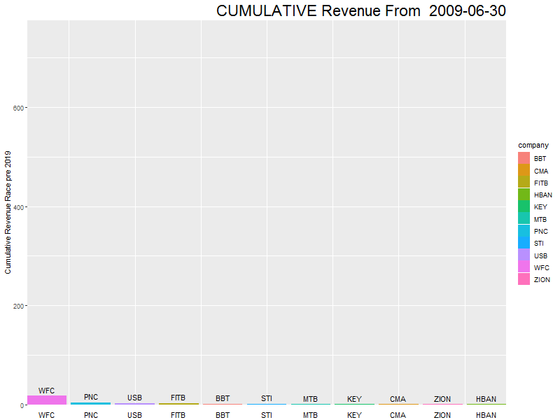

## API Project
Repository contains a project built as a self contained notebook as well as R scripts individualized to run on cmd. Both Notebook files and .R files assume a DBA has created a MySQL database for us and we have saved our credential file. The script loads the credential file saved locally as a .cnf file. Please find the following line of code, it should be located in the build_database.R and the notebook file. Amend this line with your credential file. 

db_credentials<-"C:\\Users\\justin\\Desktop\\xmedia.cnf"

The credentials should be saved as a .cnf and have the following format:  
[db_name] 
user=user_Name 
password= pw  
host= host  
port= port  
database= db_name   

### .R files
The .R files are all loaded into a subfolder on this hub called r_scripts. If you want to execute the scripts run the execute_windows_functions.R script locally. This script Will call the other scripts directly from Github and execute the project’s work flow. The order of execution is as follows:

####  execute_windows_functions.R-->load_packages.R-->load_functions.R-->build_database.R-->Windows_functions.R
 
 
The build_databse.R script, executes a script which makes a request to the api, builds an R dataframe, and inserts that R dataframe into a MYSQL database. As mentioned, execute_windows_functions.R calls all other scripts. There are various print statements sent to the CMD throughout to validate the flow is working. One key difference between the  R scripts and the notebook is the R scripts will save CSV files to CWD. These CSV files store the results from the windows function queries.  These CSV files have been added to the folder csv_files

### Notebook file
The notebook file is called api_request_project.rmd. An HTML version of the notebook has been added to the directory. The windows functions act differently in the notebook file. Instead of saving query results to CSV files the notebok prints the results using the datatable package.	The notebook presents a documented step by step explanation for the code as well as more tables and graphs. One major functional difference is that the notebook file doesn't overwrite a table if it already exists. I decided to amend the .R script files table creation function.  The notebook file will refuse to overwrite a previous MYSQL table, where the R script will overwrite by default. The notebook file includes an EDA in R section and those graphs are stored on the git in the figure.html folder

You can preview the html document [here](http://rpubs.com/justin_herman_42/521061) . It is the easiest way to explore this project.

For an example of a fun animation, below I created a revenue race between the banks with gganimate:

